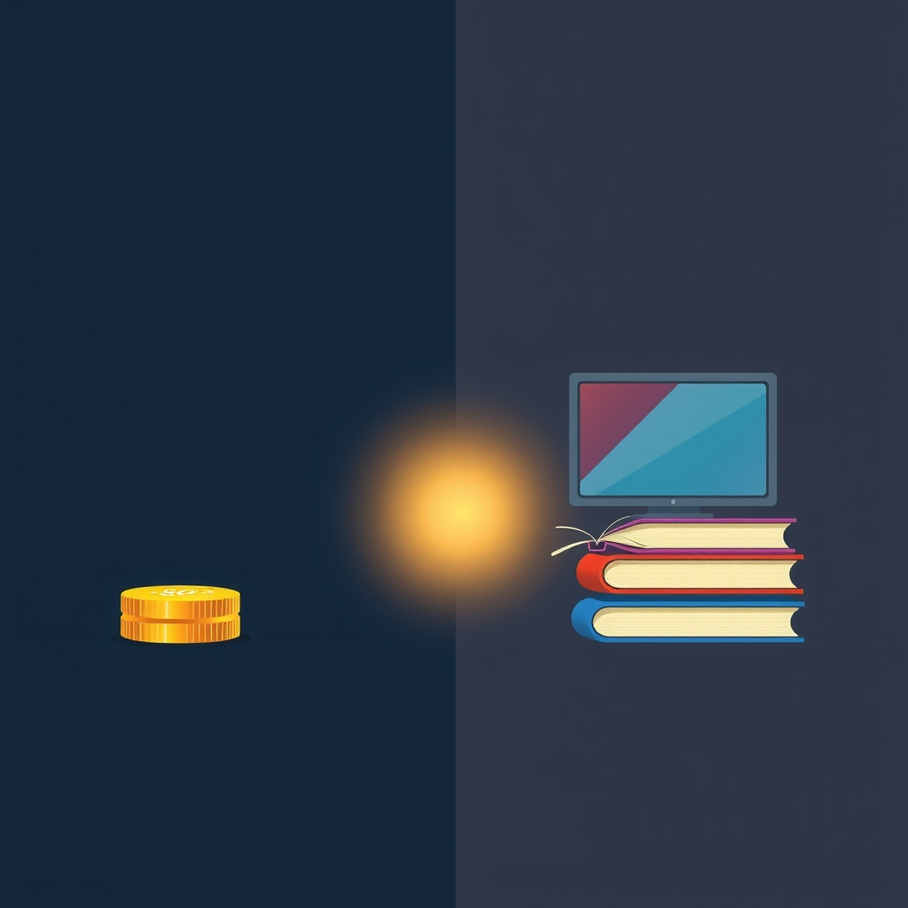

[Home](../index.md) > [Reflections](./index.md) | [⏮️](./2025-07-26.md) [⏭️](./2025-07-28.md)  
# 2025-07-27 | 🤏🪙 80/20 📺📚  
  
## [📺 Videos](../videos/index.md)  
- [🚀📈🤯🚨 How To Be So Productive That It Feels ILLEGAL](../videos/how-to-be-so-productive-that-it-feels-illegal.md)  
  
## [📚 Books](../books/index.md)  
- [💯⬇️⬆️ The 80 20 Principle: The Secret to Achieving More with Less](../books/the-80-20-principle-the-secret-to-achieving-more-with-less.md)