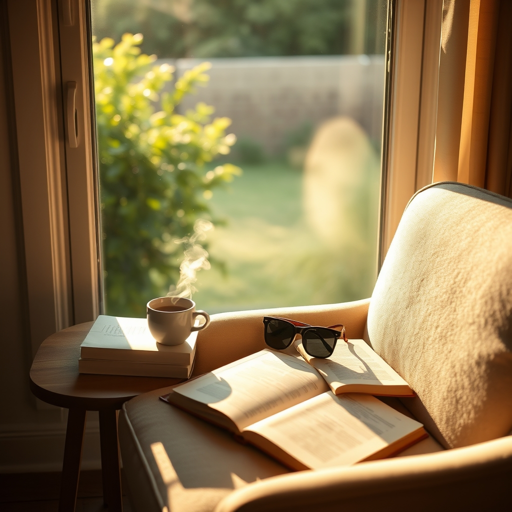

[Home](../index.md) > [Reflections](./index.md) | [⏮️](./2025-08-02.md) [⏭️](./2025-08-04.md)  
# 2025-08-03 | 😎 Chill 📚  
  
  
## 📚 Books  
- ▶️ Started [🔋⬇️⬆️ The Power of the Downstate: Recharge Your Life Using Your Body's Own Restorative Systems](../books/the-power-of-the-downstate-recharge-your-life-using-your-bodys-own-restorative-systems.md)  
- [📵 How to Do Nothing: Resisting the Attention Economy](../books/how-to-do-nothing-resisting-the-attention-economy.md)