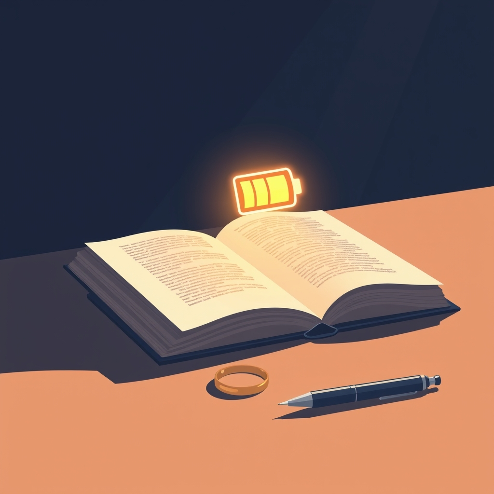

[Home](../index.md) > [Reflections](./index.md) | [⏮️](./2025-08-15.md) [⏭️](./2025-08-17.md)  
# 2025-08-16 | 💍 Engage 📚  
  
  
## [📚 Books](../books/index.md)  
- [🔋📈 The Power of Full Engagement: Managing Energy, Not Time, Is the Key to High Performance and Personal Renewal](../books/the-power-of-full-engagement-managing-energy-not-time-is-the-key-to-high-performance-and-personal-renewal.md)