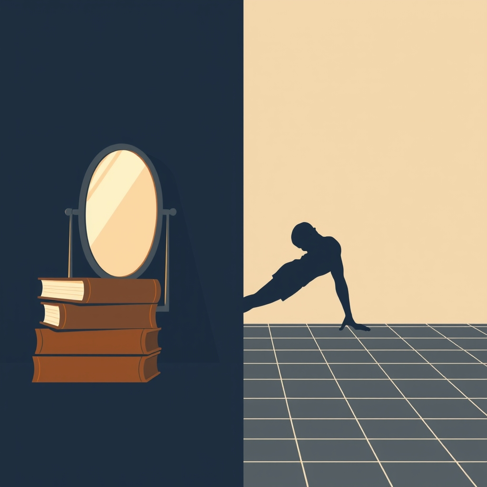

[Home](../index.md) > [Reflections](./index.md) | [⏮️](./2025-08-23.md) [⏭️](./2025-08-25.md)  
# 2025-08-24 | 😇 Righteous | 🏋🏼‍♀️ Masochism 📚🪞  
  
## [📚 Books](../books/index.md)  
- ▶️ Starting [😇🧠 The Righteous Mind: Why Good People Are Divided by Politics and Religion](../books/the-righteous-mind.md)  
- [🤔🧩⚖️ Patterns, Thinking, and Cognition: A Theory of Judgment](../books/patterns-thinking-and-cognition-a-theory-of-judgment.md)  
  
## ⏱️ Four Minutes of Masochism  
- 🌅 For some time now, inspired by this video [🌅🧠🚀♾️ This morning routine is scientifically proven to make you limitless](../videos/this-morning-routine-is-scientifically-proven-to-make-you-limitless.md), I've been doing 4 minutes of high intensity exercise as one of the first things I do every day.  
- 💪 My typical routine is  
    - 😩 Procrastinate a bit, trying to convince myself to do this again  
    - 📱 Open the stopwatch app on my phone  
    - ⬇️ Get on the floor  
    - 🧘 Stretch a bit, procrastinating for a few more seconds before assuming the plank position  
    - ⏱️ Start the stopwatch  
    - 🪨 Plank for 60 - 90 seconds  
    - 🏋️ Struggle to do 10 pushups  
    - 🧍 Stand up and do 30-50 squats  
    - ⬇️ Get back down and do a plank until time is up  
        - 💪 or sometimes up to a minute longer depending on how I feel  
- ✨ I find it almost miraculous in its effectiveness.  
- 🧠 I'm much more alert and able to focus after these four minutes of masochism.  
- 🔁 I've even started doing four minutes before focused work sessions, sometimes 2 or 3 times a day.  
- 😟 I still worry that I won't be able to do the full 4 minutes  
- ⏳ The boost in brain power doesn't tend to follow immediately, but slowly tapers in after a cool down period.  
  
## 🐦 Tweet  
<blockquote class="twitter-tweet" data-theme="dark">
2025-08-24 | 😇 Righteous | 🏋🏼‍♀️ Masochism 📚🪞  🧠 Psychology | ⏱️ Exercise | 🌅 Routines | 🧘 Planking | 💪 Pushups | 🧍 Squats | 🧠 Focus | ✨ Effectiveness<a href="https://t.co/ONtPGeISlX">https://t.co/ONtPGeISlX</a>
&mdash; Bryan Grounds (@bagrounds) <a href="https://twitter.com/bagrounds/status/1959997109710766435?ref_src=twsrc%5Etfw">August 25, 2025</a></blockquote> 