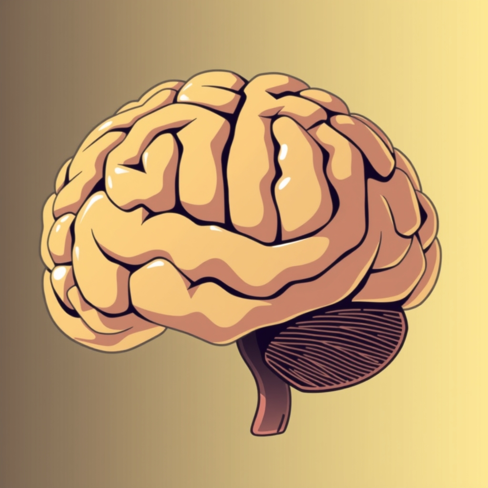

[Home](../index.md) > [Reflections](./index.md) | [⏮️](./2025-08-30.md) [⏭️](./2025-09-01.md)  
# 2025-08-31 | 🧮 Reasoning | 🏃🏼‍♀️ Strolling  
  
## [📄 Articles](../articles/index.md)  
- [🧠🤖📈 Scientists just developed a new AI modeled on the human brain — it's outperforming LLMs like ChatGPT at reasoning tasks](../articles/scientists-just-developed-a-new-ai-modeled-on-the-human-brain-its-outperforming-llms-like-chatgpt-at-reasoning-tasks.md)  
- [🧠🪜⏱️📈 Hierarchical gradients of multiple timescales in the mammalian forebrain](../articles/hierarchical-gradients-of-multiple-timescales-in-the-mammalian-forebrain.md)  
  
## [🤖💬 Bot Chats](../bot-chats/index.md)  
- [👶🏼🛒🏃🏼‍♀️🦮💲🦮 Jogging Stroller Buying Guide](../bot-chats/jogging-stroller-buying-guide.md)  
  
## [📚 Books](../books/index.md)  
- [🧠🔄 Livewired: The Inside Story of the Ever-Changing Brain](../books/livewired-the-inside-story-of-the-ever-changing-brain.md)  
  
## ✍🏼 Titles  
- [2024-06-01 | 🎏 Streamline | 👀 Focus | 🔀 Merge 📺⌨️](./2024-06-01.md)