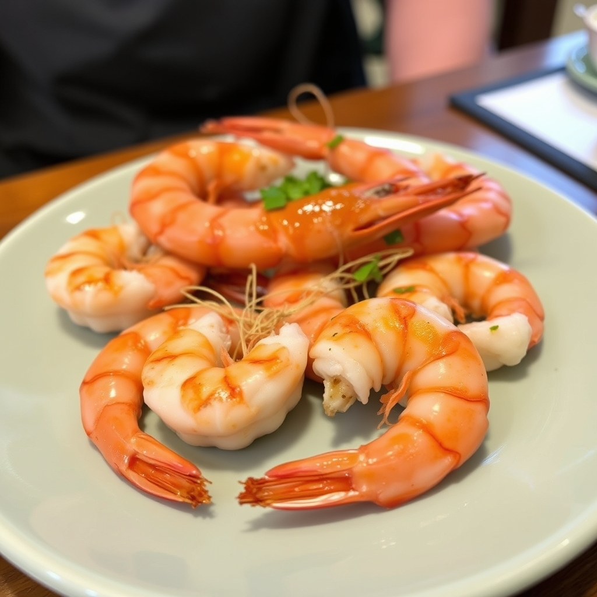

[Home](../index.md) > [Reflections](./index.md) | [⏮️](./2025-08-31.md) [⏭️](./2025-09-02.md)  
# 2025-09-01 | 🧠 Embodied | 🍤 Shrimp 📚  
  
## [📚 Books](../books/index.md)  
- [🧠🫂 The Embodied Mind: Cognitive Science and Human Experience](../books/the-embodied-mind-cognitive-science-and-human-experience.md)  
  
## 👶🏼 Firsts  
- 🍤 Shrimp  
  
## 🦋 Bluesky    
<blockquote class="bluesky-embed" data-bluesky-uri="at://did:plc:i4yli6h7x2uoj7acxunww2fc/app.bsky.feed.post/3ms7i2onijn2d" data-bluesky-cid="bafyreihkcbcg6xsddptcjomnhvz6uhzxlxgftp4k5sbgvhx6k2epetr5gq">
2025-09-01 | 🧠 Embodied | 🍤 Shrimp 📚  
  
#AI Q: 🧠 Does the mind truly exist outside the body?  
  
🧠 Cognitive Science | 📖 Reading Notes | 🦐 First Tastes  
https://bagrounds.org/reflections/2025-09-01
&mdash; <a href="https://bsky.app/profile/did:plc:i4yli6h7x2uoj7acxunww2fc?ref_src=embed">Bryan Grounds (@bagrounds.bsky.social)</a> <a href="https://bsky.app/profile/did:plc:i4yli6h7x2uoj7acxunww2fc/post/3ms7i2onijn2d?ref_src=embed">2026-08-03T21:48:55.000Z</a></blockquote>