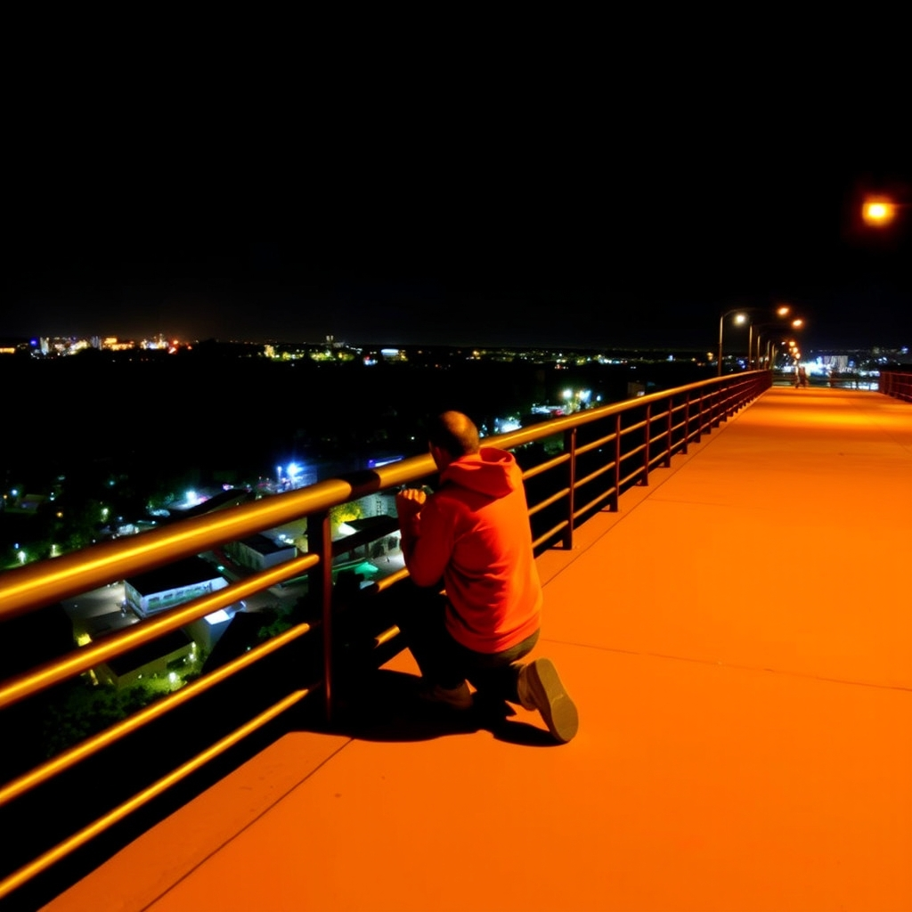

[Home](../index.md) > [Reflections](./index.md) | [⏮️](./2025-09-01.md) [⏭️](./2025-09-03.md)  
# 2025-09-02 | 🧠 Mind | 🧎🏼‍♂️ Kneeling 📚👶🏼  
  
## [📚 Books](../books/index.md)  
- [🧠🌱🤔 Mind in Life: Biology, Phenomenology, and the Sciences of Mind](../books/mind-in-life-biology-phenomenology-and-the-sciences-of-mind.md)  
  
## 👶🏼 Firsts  
- 🚧 Kneeling with rail support  
  
## 🦋 Bluesky    
<blockquote class="bluesky-embed" data-bluesky-uri="at://did:plc:i4yli6h7x2uoj7acxunww2fc/app.bsky.feed.post/3mrpdxl3pvs24" data-bluesky-cid="bafyreidoszpuvxu3knac3psfdpmsxb7or4ziren6qawf44xuwlxhbxipoi">
2025-09-02 | 🧠 Mind | 🧎🏼‍♂️ Kneeling 📚👶🏼  
  
#AI Q: 🧘 Does physical posture change the way the mind thinks?  
  
🧬 Phenomenology &amp; Biology | 👶 Baby Milestones | 🏗️ Motor Skills  
https://bagrounds.org/reflections/2025-09-02
&mdash; <a href="https://bsky.app/profile/did:plc:i4yli6h7x2uoj7acxunww2fc?ref_src=embed">Bryan Grounds (@bagrounds.bsky.social)</a> <a href="https://bsky.app/profile/did:plc:i4yli6h7x2uoj7acxunww2fc/post/3mrpdxl3pvs24?ref_src=embed">2026-07-28T11:53:00.000Z</a></blockquote>