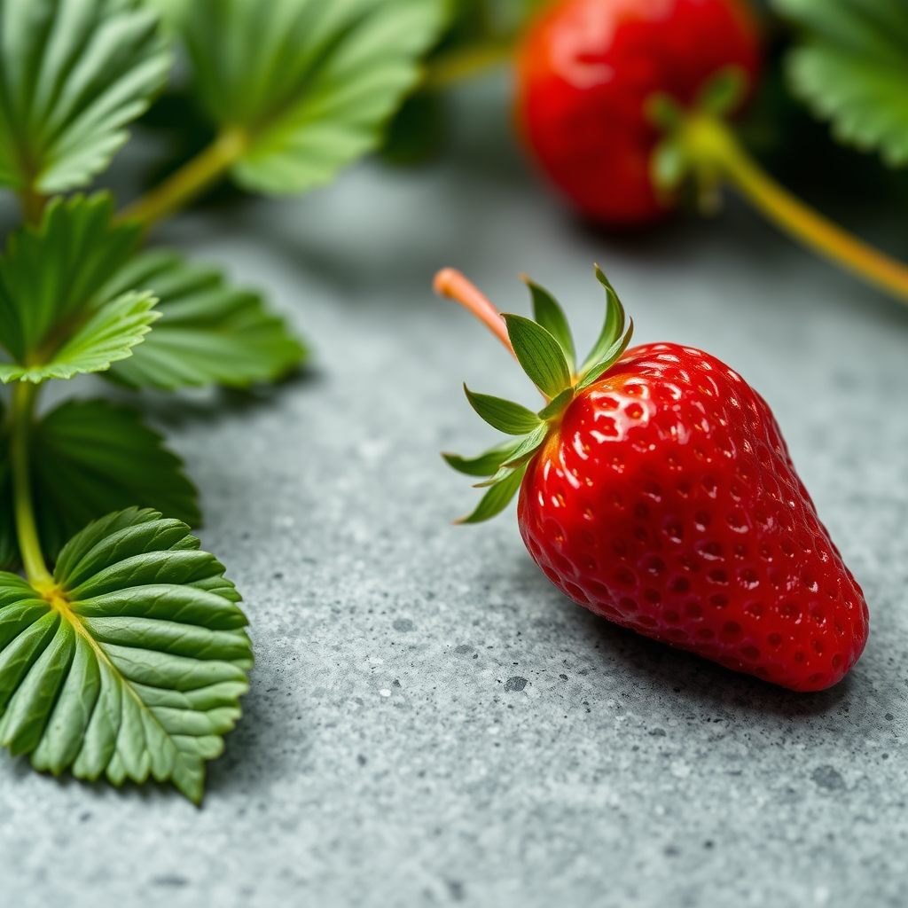

[Home](../index.md) > [Reflections](./index.md) | [⏮️](./2025-09-03.md) [⏭️](./2025-09-05.md)  
# 2025-09-04 | 🏆 Success | 😇 Virtue | 🍓 Strawberry 📺📚👶🏼  
  
## [📺 Videos](../videos/index.md)  
- [🧪📈✅💡 The secret formula that guarantees success (according to science)](../videos/the-secret-formula-that-guarantees-success-according-to-science.md)  
  
## [📚 Books](../books/index.md)  
- ⏯️ Continuing [😀📜 The Happiness Hypothesis: Finding Modern Truth in Ancient Wisdom](../books/the-happiness-hypothesis-finding-modern-truth-in-ancient-wisdom.md)  
- [👴🏽📚 The Teachings of Ptahhotep: The Oldest Book in the World](../books/the-teachings-of-ptahhotep-the-oldest-book-in-the-world.md)  
- [⚡️ The Autobiograpy of Benjamin Franklin](../books/the-autobiography-of-benjamin-franklin.md)  
  
## 👶🏼 Firsts  
- 🍓 Strawberry  
  
## 🐦 Tweet  
<blockquote class="twitter-tweet" data-theme="dark">
2025-09-04 | 🏆 Success | 😇 Virtue | 🍓 Strawberry 📺📚👶🏼  🧪 Science | 😀 Happiness Hypothesis | 👴🏽 Ptahhotep Teachings | ⚡️ Franklin Autobiography | 👶🏼 Firsts<a href="https://t.co/BKgeJXm3s8">https://t.co/BKgeJXm3s8</a>
&mdash; Bryan Grounds (@bagrounds) <a href="https://twitter.com/bagrounds/status/1964008686168199637?ref_src=twsrc%5Etfw">September 5, 2025</a></blockquote> 