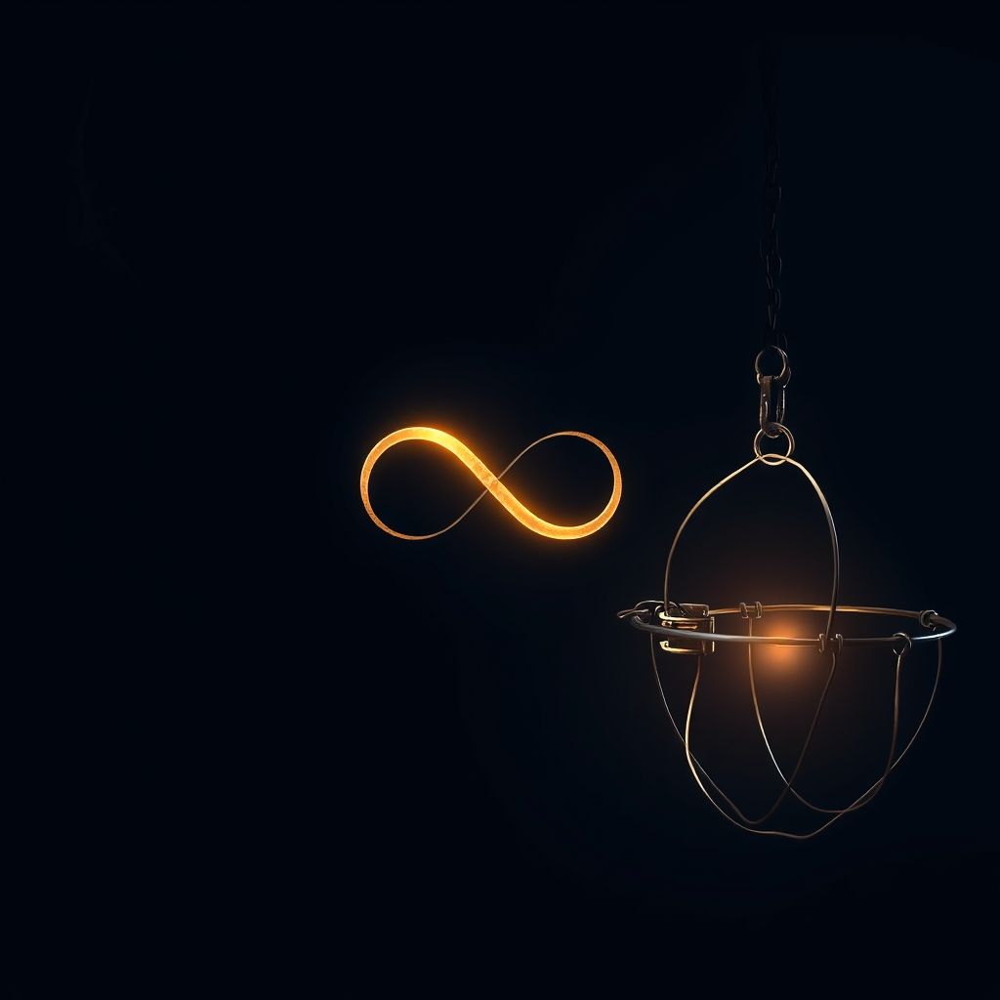

[Home](../index.md) > [Reflections](./index.md) | [⏮️](./2025-09-05.md) [⏭️](./2025-09-07.md)  
# 2025-09-06 | 👿 Demon | 🪤 Trap | ♾️ Resilience 📚📺  
  
  
## [📚 Books](../books/index.md)  
- [☀️👿 The Noonday Demon: An Atlas of Depression](../books/the-noonday-demon-an-atlas-of-depression.md)  
- [😩😊 The Happiness Trap: How to Stop Struggling and Start Living](../books/the-happiness-trap-how-to-stop-struggling-and-start-living.md)  
  
## [📺 Videos](../videos/index.md)  
- [🛠️⚙️🚀🛡️ The simple system that makes you unstoppable](../videos/the-simple-system-that-makes-you-unstoppable.md)  
- [🧠🛠️♾️💪 How to reprogram your mind to have infinite resilience](../videos/how-to-reprogram-your-mind-to-have-infinite-resilience.md)