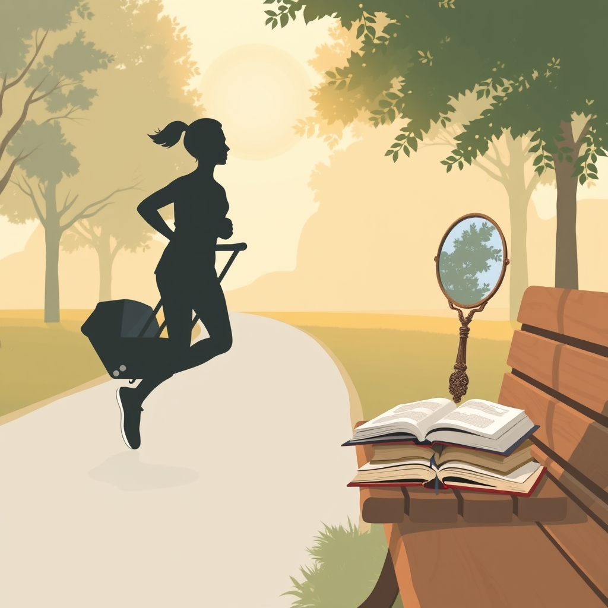

[Home](../index.md) > [Reflections](./index.md) | [⏮️](./2025-09-08.md) [⏭️](./2025-09-10.md)  
# 2025-09-09 | 🧠 Learning | 🏃🏼‍♀️ Running 📚🪞  
  
  
## [📚 Books](../books/index.md)  
- ⏯️ Continuing [🧠📚💡🧩 The Learning Brain](../books/the-learning-brain.md)  
  
## 🗓️ 7 Consecutive Days 🎉  
- Running with [👶🏃🌆 Thule Urban Glide 3](../products/thule-urban-glide-3.md)  
- 🧭 Steering  
    - 🌪️ on day 1, felt unstable  
    - ✅ on day 2, I locked the front wheel the right way around  
    - 🙌 and it's handled very nicely since then  
    - 💡 I got some nice tips from a Reddit thread  
- ❤️‍🩹 Heart Rate Variability  
    - 📈 is at its highest reading today since July. 🎉 Feels good!  
- 🦵 Shins  
    - 🤕 finally starting to feel some stress  
    - 🐢 I should ease up on the running  
    - 🔄 and switch to  
        - 🚴 lower impact cardio  
        - 🏋️ and resistance training for my legs  
    - [🏃🦵🤕 SHIN SPLINTS for Runners: Challenges, Causes, and Rehab](../videos/shin-splints-for-runners-challenges-causes-and-rehab.md)