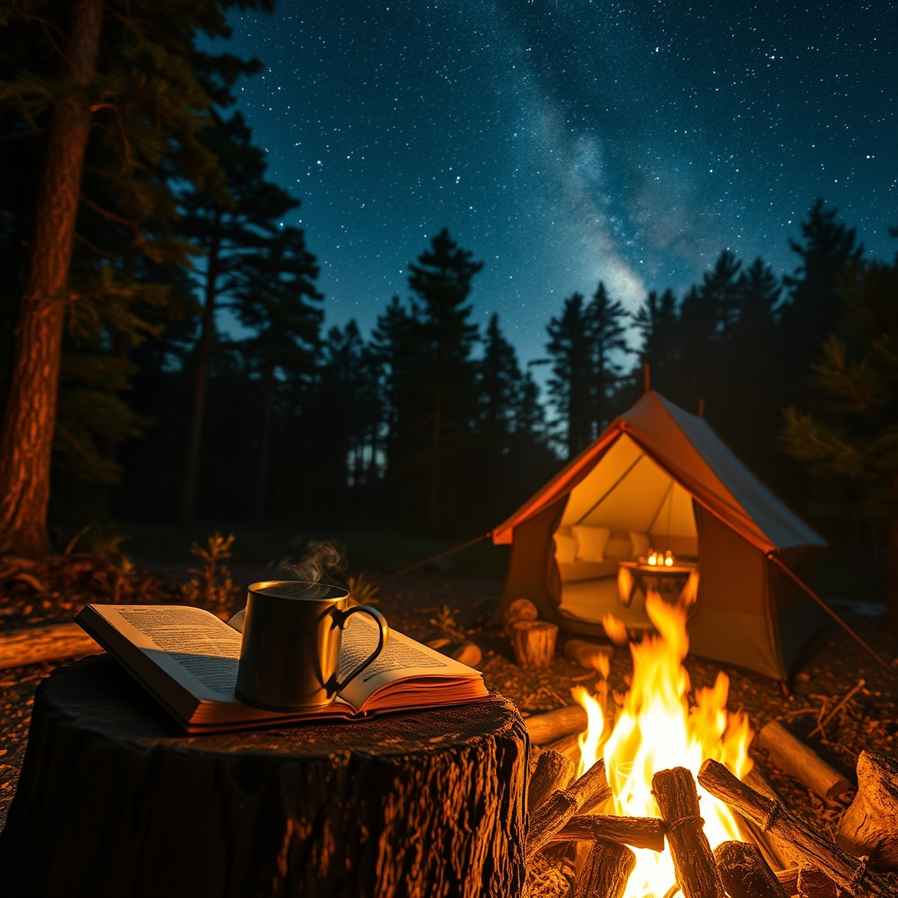

[Home](../index.md) > [Reflections](./index.md) | [⏮️](./2025-09-18.md) [⏭️](./2025-09-20.md)  
# 2025-09-19 | 🏕️ Camping 📚  
  
  
## [📚 Books](../books/index.md)  
- [⛺🔥 The Campout Cookbook: Inspired Recipes for Cooking Around the Fire and Under the Stars](../books/the-campout-cookbook-inspired-recipes-for-cooking-around-the-fire-and-under-the-stars.md)  
  
## 🦋 Bluesky    
<blockquote class="bluesky-embed" data-bluesky-uri="at://did:plc:i4yli6h7x2uoj7acxunww2fc/app.bsky.feed.post/3mpncvbxw7n27" data-bluesky-cid="bafyreidrooskchqxzdfc22sifdqaz4e7iwyeswryhoqlrhqj26q5tdxtji">
2025-09-19 | 🏕️ Camping 📚  
  
#AI Q: 🏕️ Essential gear or favorite meal for the perfect campfire experience?  
  
🔥 Campfire Cooking | 🧑‍🍳 Outdoor Recipes | ✨ Wilderness Life  
https://bagrounds.org/reflections/2025-09-19
&mdash; <a href="https://bsky.app/profile/did:plc:i4yli6h7x2uoj7acxunww2fc?ref_src=embed">Bryan Grounds (@bagrounds.bsky.social)</a> <a href="https://bsky.app/profile/did:plc:i4yli6h7x2uoj7acxunww2fc/post/3mpncvbxw7n27?ref_src=embed">2026-07-02T05:38:07.000Z</a></blockquote>