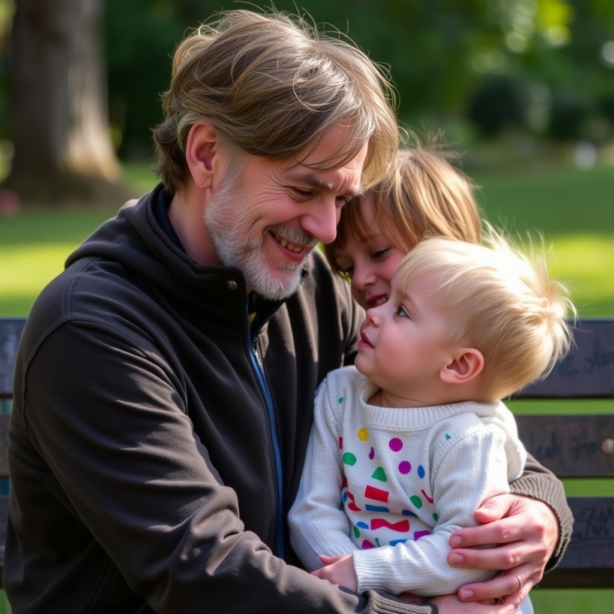

[Home](../index.md) > [Reflections](./index.md) | [⏮️](./2025-09-25.md) [⏭️](./2025-09-27.md)  
# 2025-09-26 | ♾️ Autism | 🧠 Emotion | 🇺🇸 Promise 📺📚📰  
  
## 📰 News  
- [🧩🗣️👎 Autism advocate calls Trump's statements on the condition 'stigmatizing'](../videos/autism-advocate-calls-trumps-statements-on-the-condition-stigmatizing.md)  
  
## [📺 Videos](../videos/index.md)  
- [🧠⚙️🛠️💡 You aren't at the mercy of your emotions -- your brain creates them | Lisa Feldman Barrett](../videos/you-arent-at-the-mercy-of-your-emotions-your-brain-creates-them-lisa-feldman-barrett.md)  
- [🤔🤯❤️📖 How to Understand Emotions | Dr. Lisa Feldman Barrett](../videos/how-to-understand-emotions-dr-lisa-feldman-barrett.md)  
  
## [📚 Books](../books/index.md)  
- [👦🗣️ The Reason I Jump: The Inner Voice of a Thirteen-Year-Old Boy with Autism](../books/the-reason-i-jump-the-inner-voice-of-a-thirteen-year-old-boy-with-autism.md)  
- [🧠🤔 How Emotions Are Made: The Secret Life of the Brain](../books/how-emotions-are-made-the-secret-life-of-the-brain.md)  
- ⏯️ Continuing [➡️🌟🗺️ A Promised Land](../books/a-promised-land.md)  
- [😢🔄 Emotion and Adaptation](../books/emotion-and-adaptation.md)  
  
## 🐦 Tweet  
<blockquote class="twitter-tweet" data-theme="dark">
2025-09-26 | ♾️ Autism | 🧠 Emotion | 🇺🇸 Promise 📺📚📰<a href="https://t.co/OvTFOBvX9w">https://t.co/OvTFOBvX9w</a>
&mdash; Bryan Grounds (@bagrounds) <a href="https://twitter.com/bagrounds/status/1971832057870549296?ref_src=twsrc%5Etfw">September 27, 2025</a></blockquote> 