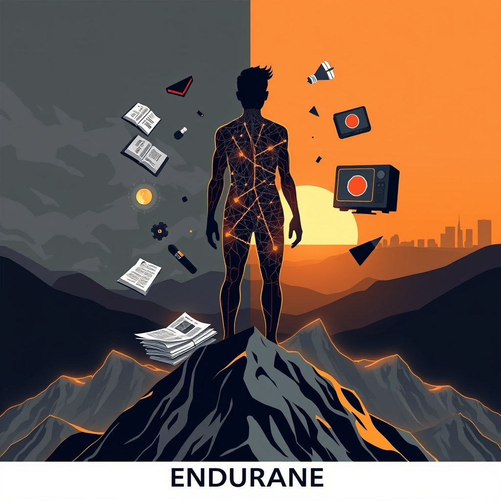

[Home](../index.md) > [Reflections](./index.md) | [⏮️](./2025-09-29.md) [⏭️](./2025-10-01.md)  
# 2025-09-30 | 🧠 Endure | 🇮🇱 Netanyahu | 🛑 Shutdown 📚📺📰📄✍️  
  
## [📚 Books](../books/index.md)  
- [🧑‍🤝‍🧑🧠 The Undoing Project: A Friendship That Changed Our Minds](../books/the-undoing-project-a-friendship-that-changed-our-minds.md)  
- ▶️ Starting [💪🧠 Endure: Mind, Body, and the Curiously Elastic Limits of Human Performance](../books/endure-mind-body-and-the-curiously-elastic-limits-of-human-performance.md)  
- [💀👨‍🏫 The Death of Expertise: The Campaign Against Established Knowledge and Why It Matters](../books/the-death-of-expertise-the-campaign-against-established-knowledge-and-why-it-matters.md)  
- [🧑‍🤝‍🧑💸 The Two-Income Trap](../books/the-two-income-trap.md)  
  
## [📺 Videos](../videos/index.md)  
- [🧠⬆️🍎🚀 Enhance Your Learning Speed & Health Using Neuroscience Based Protocols | Dr. Poppy Crum](../videos/enhance-your-learning-speed-health-using-neuroscience-based-protocols-dr-poppy-crum.md)  
- [🇮🇱🎤📺 Netanyahu: Last Week Tonight with John Oliver (HBO)](../videos/netanyahu-last-week-tonight-with-john-oliver-hbo.md)  
  
## 📰 News  
- [🏛️💥🧱🚫 Government barreling toward shutdown with Congress in partisan deadlock](../videos/government-barreling-toward-shutdown-with-congress-in-partisan-deadlock.md)  
- [📺🪖🇺🇸 WATCH: Hegseth's full remarks on new military directives ending 'politically correct' leadership](../videos/watch-hegseths-full-remarks-on-new-military-directives-ending-politically-correct-leadership.md)  
- [👩‍👧‍👦💼⬇️ Why so many mothers with young children are leaving the workforce](../videos/why-so-many-mothers-with-young-children-are-leaving-the-workforce.md)  
  
## [📄 Articles](../articles/index.md)  
- [💰⚙️📈🔍 Defining and Characterizing Reward Hacking](../articles/defining-and-characterizing-reward-hacking.md)  
  
## ✍️ Titles  
- [2024-05-08 | ⌨️ Codin | 🌞 Outside | 🩸 Metabolism 💾📺](./2024-05-08.md)  
  
## 🐦 Tweet  
<blockquote class="twitter-tweet" data-theme="dark">
2025-09-30 | 🧠 Endure | 🇮🇱 Netanyahu | 🛑 Shutdown 📚📺📰📄✍️<a href="https://t.co/ZnSDKpS5SR">https://t.co/ZnSDKpS5SR</a>
&mdash; Bryan Grounds (@bagrounds) <a href="https://twitter.com/bagrounds/status/1973854941652701490?ref_src=twsrc%5Etfw">October 2, 2025</a></blockquote> 