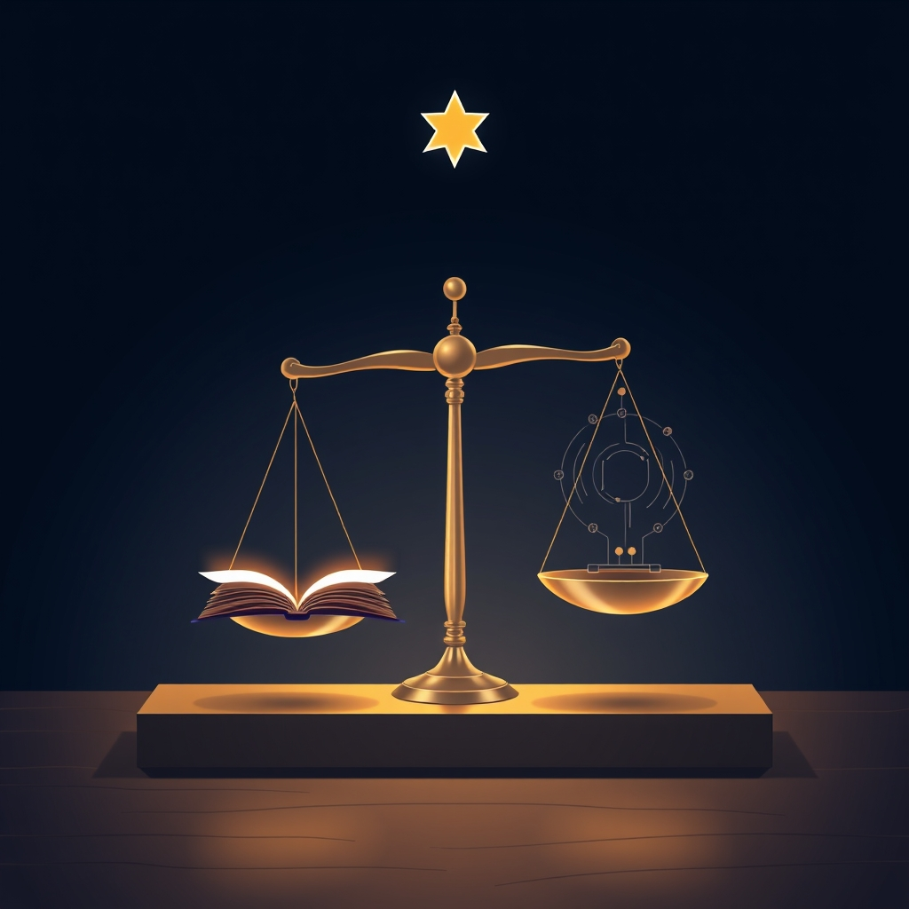

[Home](../index.md) > [Reflections](./index.md) | [⏮️](./2025-10-05.md) [⏭️](./2025-10-07.md)  
# 2025-10-06 | ⭐ Promised | 🔮 Prediction | ⚖️ Law 📚📺  
  
  
## [📚 Books](../books/index.md)  
- ⏯️ Continuing [➡️🌟🗺️ A Promised Land](../books/a-promised-land.md)  
- [🤕👶 The Coddling of the American Mind: How Good Intentions and Bad Ideas Are Setting Up a Generation for Failure](../books/the-coddling-of-the-american-mind-how-good-intentions-and-bad-ideas-are-setting-up-a-generation-for-failure.md)  
- ▶️ Starting [🤖📈 Prediction Machines: The Simple Economics of Artificial Intelligence](../books/prediction-machines-the-simple-economics-of-artificial-intelligence.md)  
- [🏛️⚖️ The Rule of Law](../books/the-rule-of-law.md)  
  
## [📺 Videos](../videos/index.md)  
- [👩‍⚖️🛑🇺🇸🏛️ Oregon governor calls Trump's actions 'an abuse of power and threat to our democracy'](../videos/oregon-governor-calls-trumps-actions-an-abuse-of-power-and-threat-to-our-democracy.md)