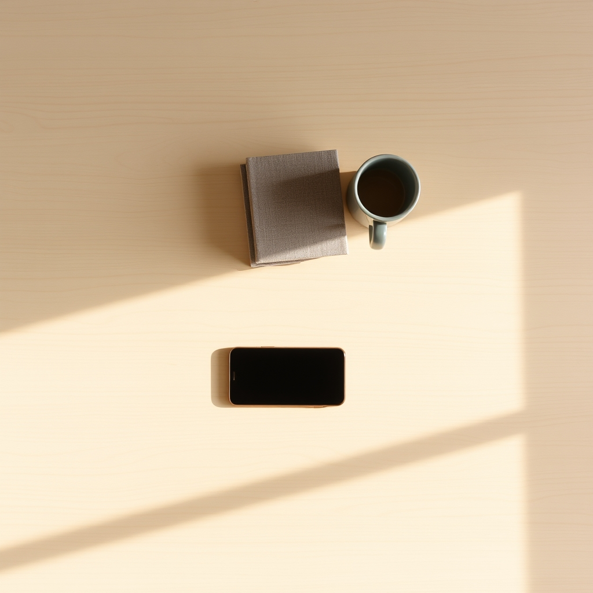

[Home](../index.md) > [Reflections](./index.md) | [⏮️](./2025-10-11.md) [⏭️](./2025-10-13.md)  
# 2025-10-12 | 🤏 Minimal | 💔 Break Up 📚  
  
  
## [📚 Books](../books/index.md)  
- ⏯️ Continuing [📱⬇️🧘 Digital Minimalism: Choosing a Focused Life in a Noisy World](../books/digital-minimalism-choosing-a-focused-life-in-a-noisy-world.md)  
- [📱💔 How to Break Up with Your Phone: The 30-Day Plan to Take Back Your Life](../books/how-to-break-up-with-your-phone-the-30-day-plan-to-take-back-your-life.md)