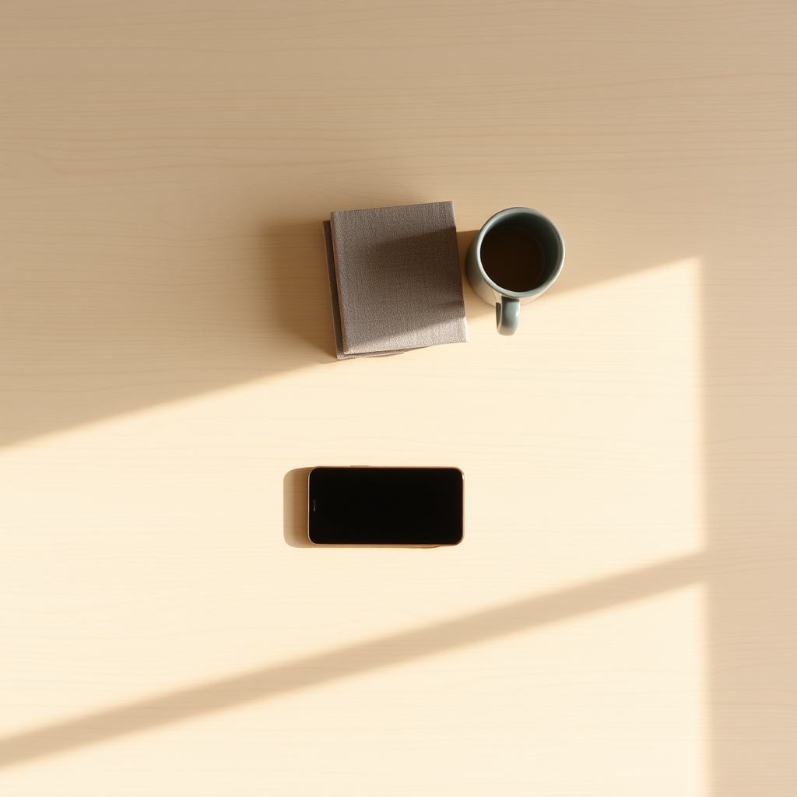

[Home](../index.md) > [Reflections](./index.md) | [⏮️](./2025-10-11.md) [⏭️](./2025-10-13.md)  
# 2025-10-12 | 🤏 Minimal | 💔 Break Up 📚  
  
  
## [📚 Books](../books/index.md)  
- ⏯️ Continuing [📱⬇️🧘 Digital Minimalism: Choosing a Focused Life in a Noisy World](../books/digital-minimalism-choosing-a-focused-life-in-a-noisy-world.md)  
- [📱💔 How to Break Up with Your Phone: The 30-Day Plan to Take Back Your Life](../books/how-to-break-up-with-your-phone-the-30-day-plan-to-take-back-your-life.md)  
  
## 🦋 Bluesky    
<blockquote class="bluesky-embed" data-bluesky-uri="at://did:plc:i4yli6h7x2uoj7acxunww2fc/app.bsky.feed.post/3mrooa4cnga24" data-bluesky-cid="bafyreiaflgjxwolxpmvyffyulz6sbzddt2bvglkntos3xrylnwolygegau">
2025-10-12 | 🤏 Minimal | 💔 Break Up 📚  
  
#AI Q: 📱 Ready to break up with your phone for thirty days?  
  
📱 Phone Detox | 🧘‍♂️ Focused Living | 💡 Digital Wellness  
https://bagrounds.org/reflections/2025-10-12
&mdash; <a href="https://bsky.app/profile/did:plc:i4yli6h7x2uoj7acxunww2fc?ref_src=embed">Bryan Grounds (@bagrounds.bsky.social)</a> <a href="https://bsky.app/profile/did:plc:i4yli6h7x2uoj7acxunww2fc/post/3mrooa4cnga24?ref_src=embed">2026-07-28T05:24:04.000Z</a></blockquote>