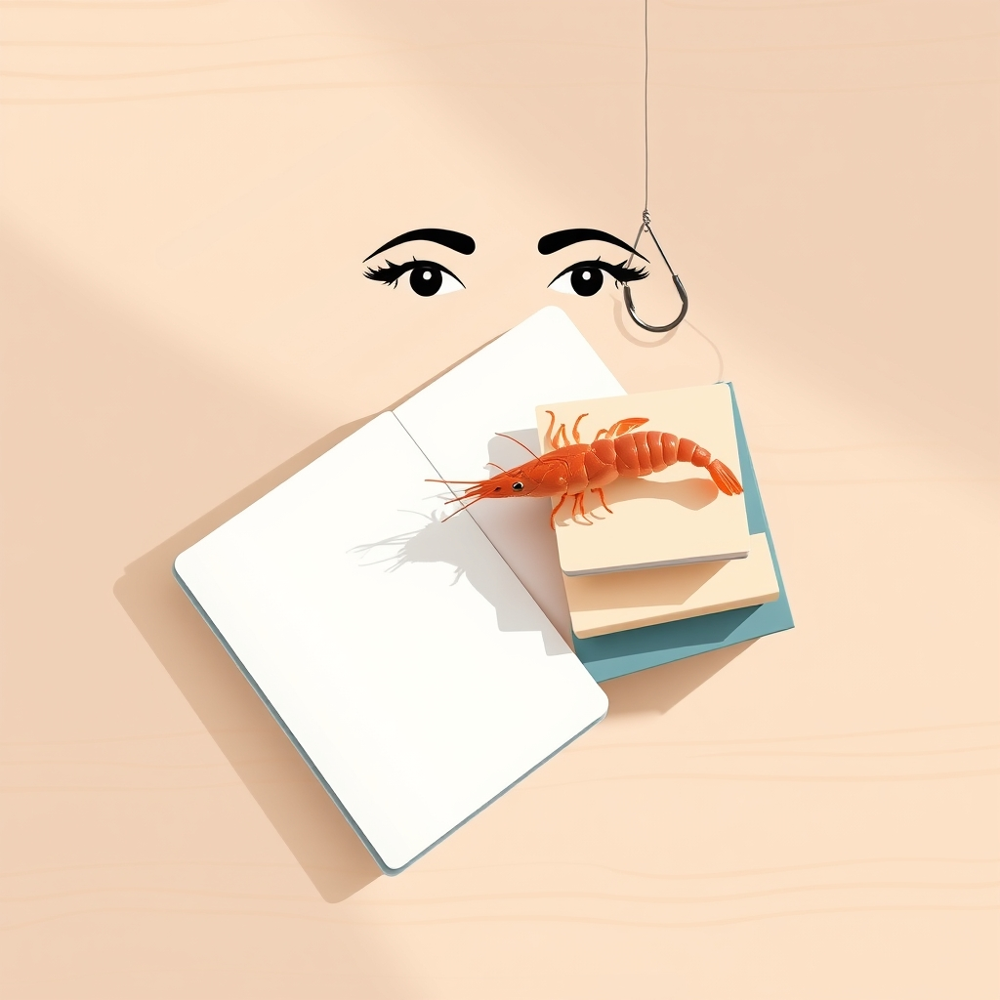

[Home](../index.md) > [Reflections](./index.md) | [⏮️](./2025-10-13.md) [⏭️](./2025-10-15.md)  
# 2025-10-14 | 🦐 Minimal | 👀 Indistractible | 🪝 Hooked 📚  
  
  
## [📚 Books](../books/index.md)  
- 🏁 Finished [📱⬇️🧘 Digital Minimalism: Choosing a Focused Life in a Noisy World](../books/digital-minimalism-choosing-a-focused-life-in-a-noisy-world.md)  
- ▶️ Starting [🧘 Indistractable: How to Control Your Attention and Choose Your Life](../books/indistractable.md)  
- [🎣📱 Hooked: How to Build Habit-Forming Products](../books/hooked-how-to-build-habit-forming-products.md)