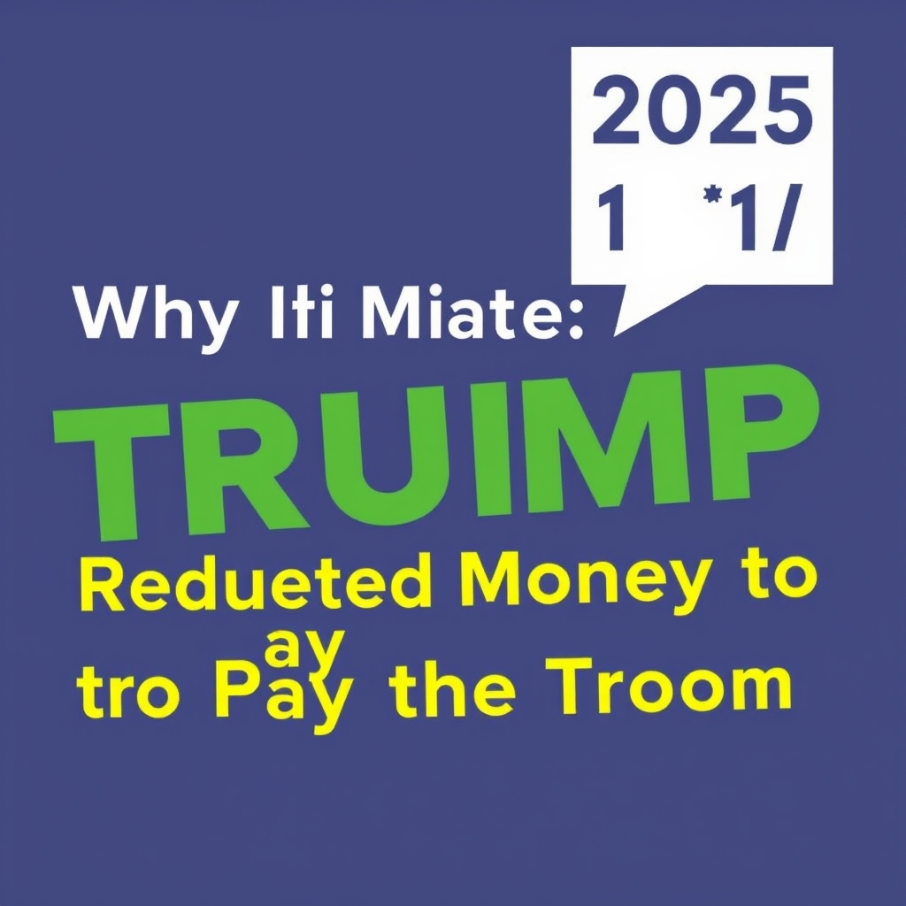

[Home](../index.md) > [Reflections](./index.md) | [⏮️](./2025-10-16.md) [⏭️](./2025-10-18.md)  
# 2025-10-17 | 🤥 Demagoguery | 📜 Law | 🤸🏼‍♀️ Mobility 📺📚  
  
## [📺 Videos](../videos/index.md)  
- [💰➡️🪖 Why It Matters That Trump Rerouted Money to Pay the Troops | Explainer](../videos/why-it-matters-that-trump-rerouted-money-to-pay-the-troops-explainer.md)  
- [🎭🤥👓 Image vs Reality—What the Administration Wants You to Think | Explainer](../videos/image-vs-reality-what-the-administration-wants-you-to-think-explainer.md)  
- [🇺🇸🗣️❓ The State of the United States: A Conversation with Jack Smith](../videos/the-state-of-the-united-states-a-conversation-with-jack-smith.md)  
- [👤🎭🏛️ Russell Vought: The Shadow President](../videos/russell-vought-the-shadow-president.md)  
  
## [📚 Books](../books/index.md)  
- [🗳️💰⬇️ The Great Suppression: Voting Rights, Corporate Cash, and the Conservative Assault on Democracy](../books/the-great-suppression-voting-rights-corporate-cash-and-the-conservative-assault-on-democracy.md)  
- [🇺🇸➡️ A Time for Choosing: The Rise of Modern American Conservatism](../books/a-time-for-choosing-the-rise-of-modern-american-conservatism.md)  
- [🇺🇸💔 The Lost Soul of the American Presidency: The Decline into Demagoguery and the Prospects for Renewal](../books/the-lost-soul-of-the-american-presidency-the-decline-into-demagoguery-and-the-prospects-for-renewal.md)  
- [🇺🇸🕵️‍♂️🚫 Where Law Ends: Inside the Mueller Investigation](../books/where-law-ends-inside-the-mueller-investigation.md)  
- ▶️ Starting [🏃🤸 Built to Move: The Ten Essential Habits to Help You Move Freely and Live Fully](../books/built-to-move-the-ten-essential-habits-to-help-you-move-freely-and-live-fully.md)