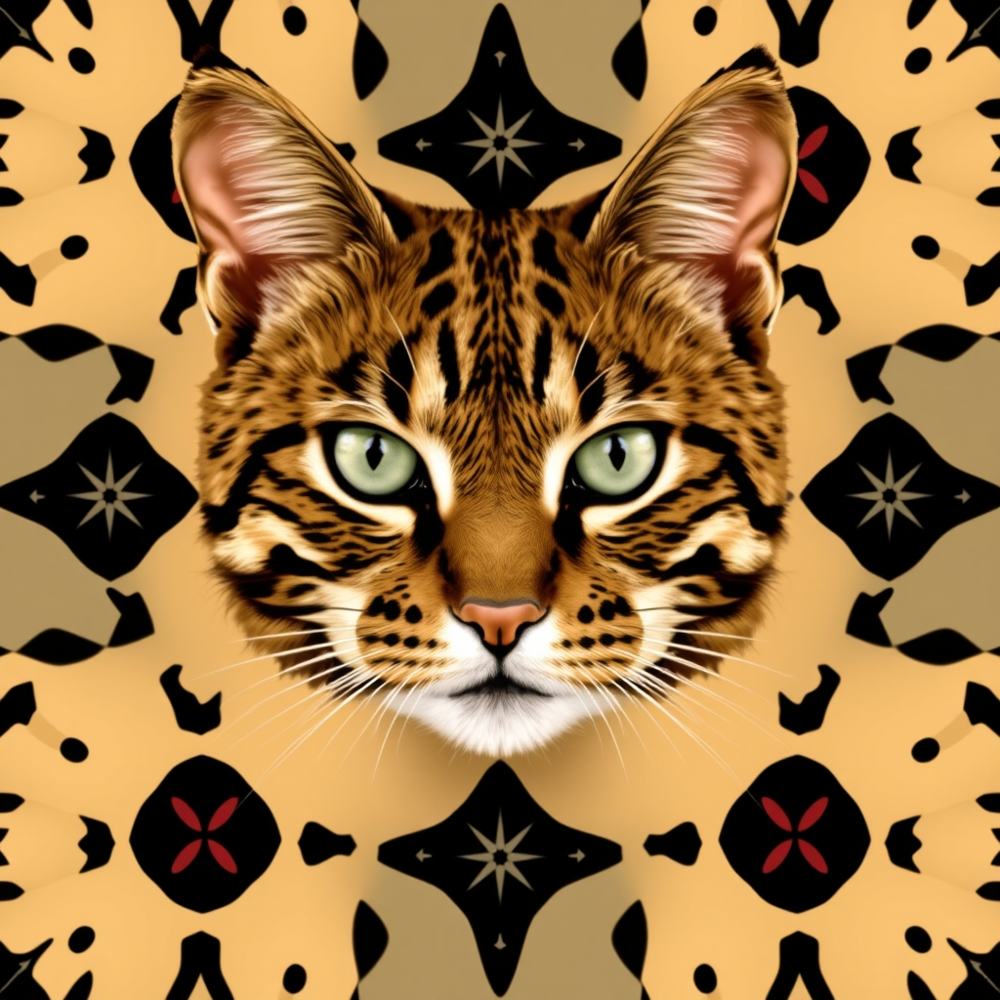

[Home](../index.md) > [Reflections](./index.md) | [⏮️](./2025-10-19.md) [⏭️](./2025-10-21.md)  
# 2025-10-20 | 🐆 Patterns | 🐾 Cats | 🔋 Mitochondria 📄📚📺  
  
## [📄 Articles](../articles/index.md)  
- [🧑‍🏫🌍🛠️📈 Agent Skills: Equipping agents for the real world with Agent Skills](../articles/equipping-agents-for-the-real-world-with-agent-skills.md)  
  
## [📚 Books](../books/index.md)  
- [🏘️🧱🏗️ A Pattern Language: Towns, Buildings, Construction](../books/a-pattern-language-towns-buildings-construction.md)  
- [⌨️🤖 Prompt Engineering for LLMs: The Art and Science of Building Large Language Model-Based Applications](../books/prompt-engineering-for-llms-the-art-and-science-of-building-large-language-model-based-applications.md)  
- [🐱👍 Think Like a Cat: How to Raise a Well-Adjusted Cat - Not a Sour Puss](../books/think-like-a-cat-how-to-raise-a-well-adjusted-cat-not-a-sour-puss.md)  
- [🐱👑 Total Cat Mojo: The Ultimate Guide to Life with Your Cat](../books/total-cat-mojo-the-ultimate-guide-to-life-with-your-cat.md)  
  
## [📺 Videos](../videos/index.md)  
- [⚡🔋💪 The Mitochondria Protocol: How to Actually Fix Your Energy](../videos/the-mitochondria-protocol-how-to-actually-fix-your-energy.md)  
  
## 🦋 Bluesky    
<blockquote class="bluesky-embed" data-bluesky-uri="at://did:plc:i4yli6h7x2uoj7acxunww2fc/app.bsky.feed.post/3mw44ig45tb2j" data-bluesky-cid="bafyreichd7fdp5jez63caqzekalaaygxxicjlflh2m4hp54dryawotdlaa">
2025-10-20 | 🐆 Patterns | 🐾 Cats | 🔋 Mitochondria 📄📚📺  
  
#AI Q: 🐆 Which biological or architectural pattern shapes your daily routine most?  
  
🤖 LLM Development | 🏗️ Urban Design | 🐈 Pet Behavior | ⚡ Bio  
https://bagrounds.org/reflections/2025-10-20
&mdash; <a href="https://bsky.app/profile/did:plc:i4yli6h7x2uoj7acxunww2fc?ref_src=embed">Bryan Grounds (@bagrounds.bsky.social)</a> <a href="https://bsky.app/profile/did:plc:i4yli6h7x2uoj7acxunww2fc/post/3mw44ig45tb2j?ref_src=embed">2026-09-22T11:24:38.000Z</a></blockquote>