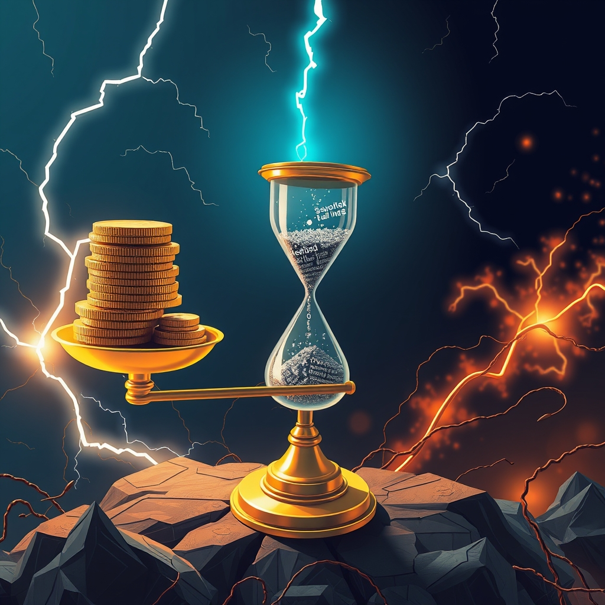

[Home](../index.md) > [Reflections](./index.md) | [⏮️](./2025-10-21.md) [⏭️](./2025-10-23.md)  
# 2025-10-22 | 👹 Corrupt 💰 Capital 💸 Costs ⚖️ Civic 💥 Conflict 📚📰📺  
  
## [📚 Books](../books/index.md)  
- [☀️😀👍😊🌻 How to Have a Good Day: Harness the Power of Behavioral Science to Transform Your Working Life](../books/how-to-have-a-good-day.md)  
- [⚕️💰🇺🇸 The Healing of America: A Global Quest for Better, Cheaper, and Fairer Health Care](../books/the-healing-of-america-a-global-quest-for-better-cheaper-and-fairer-health-care.md)  
- ⏯️ Continuing [🏎️⛽ Drive: The Surprising Truth About What Motivates Us](../books/drive-the-surprising-truth-about-what-motivates-us.md)  
- [📊📉🏛️ Weapons of Math Destruction: How Big Data Increases Inequality and Threatens Democracy](../books/weapons-of-math-destruction-how-big-data-increases-inequality-and-threatens-democracy.md)  
- [💔💻 Burn Book: A Tech Love Story](../books/burn-book-a-tech-love-story.md)  
  
## 📰 News  
- [🗣️⏱️🏛️🛑 WATCH: Sen. Merkley concludes marathon 22-hour speech protesting Trump amid shutdown](../videos/watch-sen-merkley-concludes-marathon-22-hour-speech-protesting-trump-amid-shutdown.md)  
- [💰📈🤕 Why millions of Americans are facing a spike in health care costs](../videos/why-millions-of-americans-are-facing-a-spike-in-health-care-costs.md)  
- [📈🗣️💥😵‍💫 The rise of viral debate videos and their impact on our ability to disagree](../videos/the-rise-of-viral-debate-videos-and-their-impact-on-our-ability-to-disagree.md)  
- [🤖🗣️⚠️😵‍💫 AI content supercharges confusion and spreads misleading information, critics warn](../videos/ai-content-supercharges-confusion-and-spreads-misleading-information-critics-warn.md)  
- [🤖👀❌📰 How to spot AI and misinformation online](../videos/how-to-spot-ai-and-misinformation-online.md)  
  
## [📺 Videos](../videos/index.md)  
- [🚧⏳ The Unfinished Revolution with Atlantic EIC Jeffrey Goldberg](../videos/the-unfinished-revolution-with-atlantic-eic-jeffrey-goldberg.md)  
- [🇩🇪⚖️🇺🇸 Blueprint Why Germany's Legacy of Accountability Should Be A Blueprint for America's Moral Reckoning](../videos/why-germanys-legacy-of-accountability-should-be-a-blueprint-for-americas-moral-reckoning.md)  
- [💰🇺🇸❓🗣️ Who Owns America? Bernie Sanders Says the Quiet Part Out Loud](../videos/who-owns-america-bernie-sanders-says-the-quiet-part-out-loud.md)  
- [👩‍💻👑🦆 Kara Swisher: Tech, Power, and Why You Should Get the F*cking Duck](../videos/kara-swisher-tech-power-and-why-you-should-get-the-fcking-duck.md)  
  
## 🐦 Tweet  
<blockquote class="twitter-tweet" data-theme="dark">
2025-10-22 | 👹 Corrupt 💰 Capital 💸 Costs ⚖️ Civic 💥 Conflict 📚📰📺  📚 Behavioral Science | 🏥 Health Care | 💔 Tech | 🪧 Protest | 😵‍💫 Viral Debate | 🤖 AI Misinformation | ⏳ Revolution | 🇩🇪 German Accountability | 🇺🇸 Wealth Distribution | 👑 Power<a href="https://t.co/DEu8Hf22WZ">https://t.co/DEu8Hf22WZ</a>
&mdash; Bryan Grounds (@bagrounds) <a href="https://twitter.com/bagrounds/status/1981499018426364379?ref_src=twsrc%5Etfw">October 23, 2025</a></blockquote> 