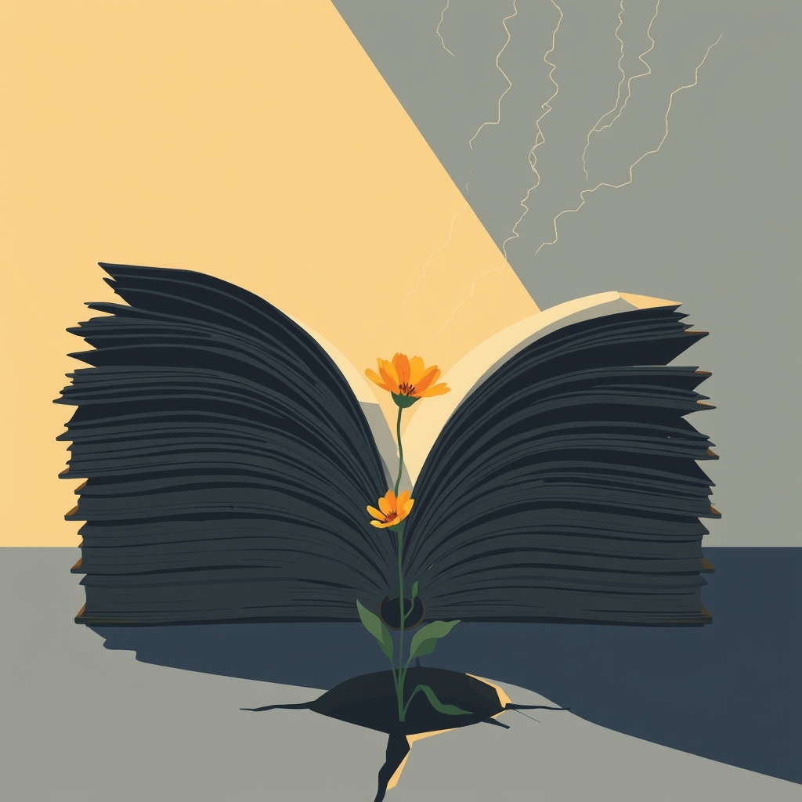

[Home](../index.md) > [Reflections](./index.md) | [⏮️](./2025-10-25.md) [⏭️](./2025-10-27.md)  
# 2025-10-26 | 👹⛓️👧🏼 Sex Trafficking | 🇺🇸🚫📚 Book Bans 📚📰  
  
  
## [📚 Books](../books/index.md)  
- [💔👊⚖️ Nobody's Girl: A Memoir of Surviving Abuse and Fighting for Justice](../books/nobodys-girl-a-memoir-of-surviving-abuse-and-fighting-for-justice.md)  
- 🏁 Finished [🗣️💡🦠 Social Physics: How Good Ideas Spread - The Lessons from a New Science](../books/social-physics.md)  
  
## 📰 News  
- [🪖🚫📚😠 Pentagon's attempt to ban books from base schools faces backlash from military families](../videos/pentagons-attempt-to-ban-books-from-base-schools-faces-backlash-from-military-families.md)