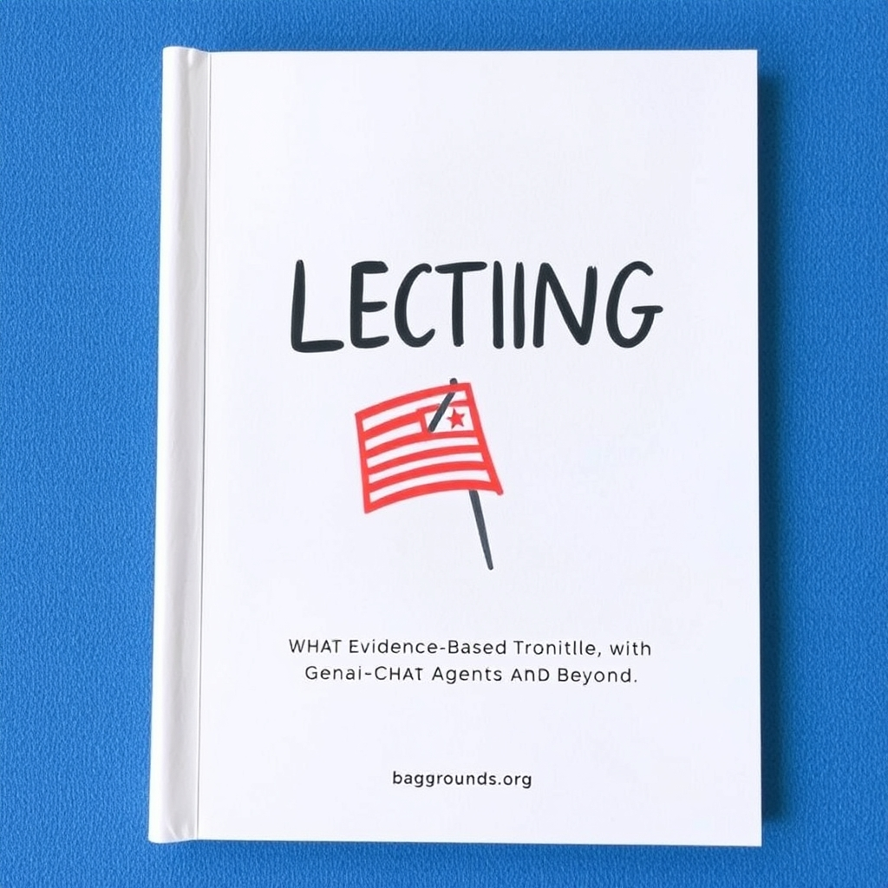

[Home](../index.md) > [Reflections](./index.md) | [⏮️](./2025-11-03.md) [⏭️](./2025-11-05.md)  
# 2025-11-04 | 🗳️ Election Day 📚📰📺  
  
## [📚 Books](../books/index.md)  
- [✅🗓️ Evidence-Based Habit Building: Finally Get Sh*t Done](../books/evidence-based-habit-building-finally-get-sht-done.md)  
- ⏯️ Continuing [🤖💻 Vibe Coding: Building Production-Grade Software With GenAI, Chat, Agents, and Beyond](../books/vibe-coding-building-production-grade-software-with-genai-chat-agents-and-beyond.md)  
- [🧑‍🤝‍🧑🐘⬆️ The Great Alignment: Race, Party Transformation, and the Rise of Donald Trump](../books/the-great-alignment-race-party-transformation-and-the-rise-of-donald-trump.md)  
- [🏛️💔 Injustice: How Politics and Fear Vanquished America's Justice Department](../books/injustice-how-politics-and-fear-vanquished-americas-justice-department.md)  
  
## 📰 News  
- [🗳️🇺🇸🔮 Voters cast ballots in elections that could signal future of U.S. politics](../videos/voters-cast-ballots-in-elections-that-could-signal-future-of-us-politics.md)  
- [👨‍⚖️🛑🇺🇸🏛️ Injustice explores Trump's decade-long effort to politicize DOJ](../videos/new-book-injustice-explores-trumps-decade-long-effort-to-politicize-doj.md)  
- [🗽🏙️🗣️ New York City Mayor-elect Zohran Mamdani Victory Speech](../videos/new-york-city-mayor-elect-zohran-mamdani-victory-speech.md)  
  
## [📺 Videos](../videos/index.md)  
- [🗳️🎉➡️ Ezra Klein: This Is How Democrats Win](../videos/ezra-klein-this-is-how-democrats-win.md)  
- [👩‍⚖️🔭⏩ Amy Coney Barrett Is Looking Beyond the Trump Era | Interesting Times with Ross Douthat](../videos/amy-coney-barrett-is-looking-beyond-the-trump-era-interesting-times-with-ross-douthat.md)