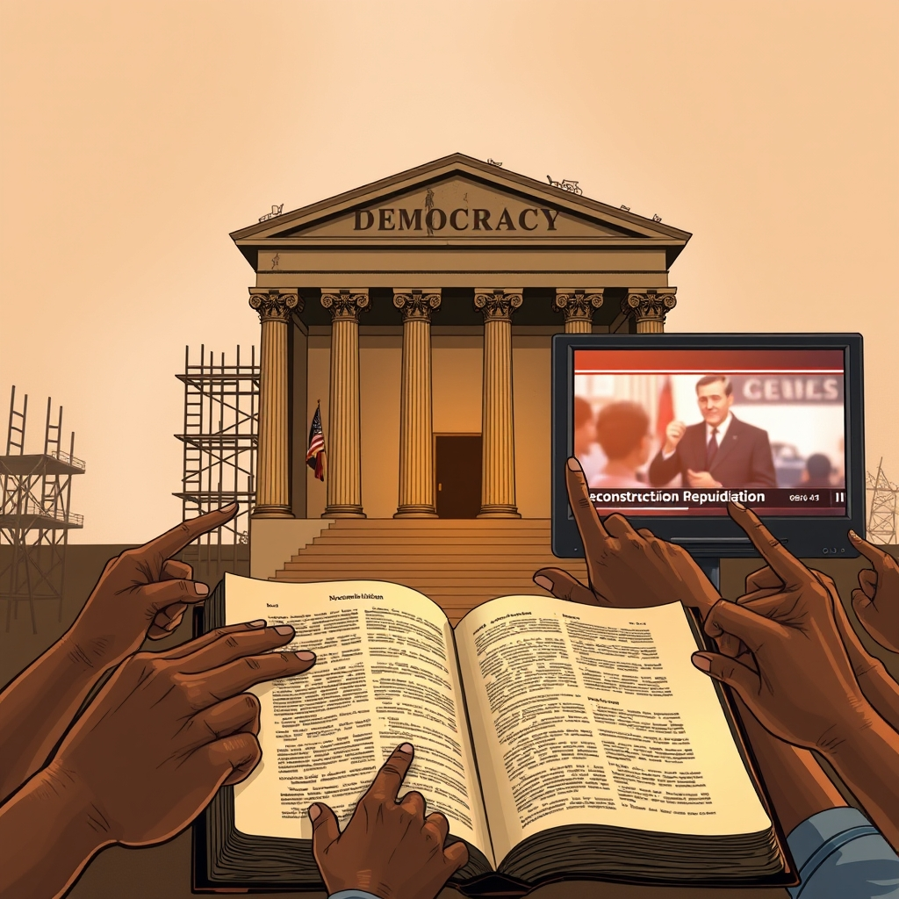

[Home](../index.md) > [Reflections](./index.md) | [⏮️](./2025-11-06.md) [⏭️](./2025-11-08.md)  
# 2025-11-07 | 🏗️ Reconstruction | 👎 Repudiation 📚📺  
  
  
## [📚 Books](../books/index.md)  
- [🧑🏿‍🤝‍🧑🏿🏛️ Black Reconstruction in America (The Oxford W. E. B. Du Bois): An Essay Toward a History of the Part Which Black Folk Played in the Attempt to Reconstruct Democracy in America, 1860-1880](../books/black-reconstruction-in-america-the-oxford-w-e-b-du-bois-an-essay-toward-a-history-of-the-part-which-black-folk-played-in-the-attempt-to-reconstruct-democracy-in-america-1860-1880.md)  
  
## [📺 Videos](../videos/index.md)  
- [📰🗣️❓ This Week in Politics | Explainer](../videos/this-week-in-politics-explainer.md)