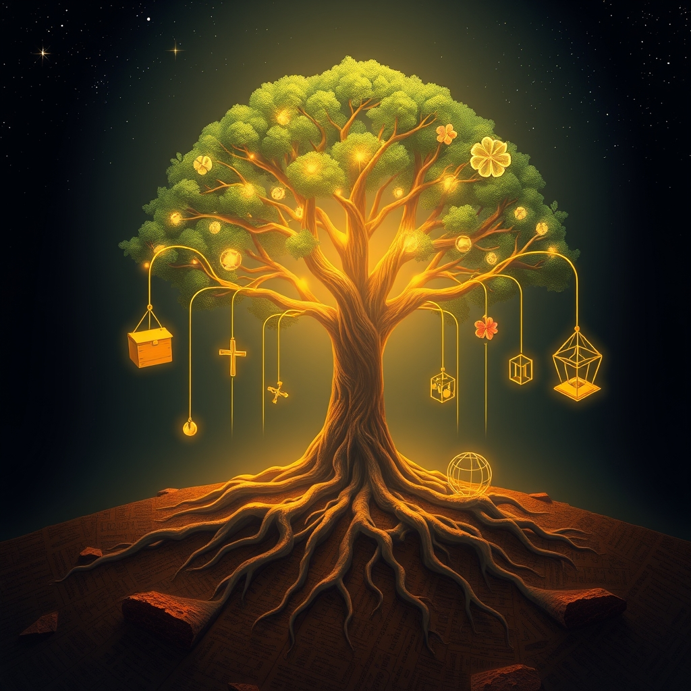

[Home](../index.md) > [Reflections](./index.md) | [⏮️](./2025-11-10.md) [⏭️](./2025-11-12.md)  
# 2025-11-11 | 🌌 Systems | 💰 Economics | 🗳️ Voting | ✝️ Christianity | 🌺 Hawaii 📚📺  
  
## [📚 Books](../books/index.md)  
- [📉🌍⏳ Limits to Growth: The 30-Year Global Update](../books/limits-to-growth-the-30-year-global-update.md)  
- [🤏🧑 Small Is Beautiful: Economics as if People Mattered](../books/small-is-beautiful-economics-as-if-people-mattered.md)  
- [🌍🆘 Earth for All: A Survival Guide for Humanity](../books/earth-for-all-a-survival-guide-for-humanity.md)  
- [⚙️🧠 Learning Systems Thinking: Essential Nonlinear Skills and Practices for Software Professionals](../books/learning-systems-thinking-essential-nonlinear-skills-and-practices-for-software-professionals.md)  
- [⚙️🔗 Quality Software Management: Systems Thinking](../books/quality-software-management-systems-thinking.md)  
- [⚠️🤖📈 Out of Control: The New Biology of Machines, Social Systems, and the Economic World](../books/out-of-control-the-new-biology-of-machines-social-systems-and-the-economic-world.md)  
- [🤖🔗👁️ Systems Thinking: An AI’s Guide to 100 Ways to Spot Connections Humans Often Overlook](../books/systems-thinking-an-ais-guide-to-100-ways-to-spot-connections-humans-often-overlook.md)  
- [⚙️🧠 The Systems Thinking Playbook: Exercises to Stretch and Build Learning and Systems Thinking Capabilities](../books/the-systems-thinking-playbook-exercises-to-stretch-and-build-learning-and-systems-thinking-capabilities.md)  
- [👥✝️ A People's History of Christianity: The Other Side of the Story](../books/a-peoples-history-of-christianity-the-other-side-of-the-story.md)  
- [🗳️⬇️🏛️ One Person, No Vote: How Voter Suppression Is Destroying Our Democracy](../books/one-person-no-vote-how-voter-suppression-is-destroying-our-democracy.md)  
- [🇺🇸👑🌺 Nation Within: The Story of America's Annexation of the Nation of Hawaii](../books/nation-within-the-story-of-americas-annexation-of-the-nation-of-hawaii.md)  
- [🇺🇸🏹 An Indigenous Peoples' History of the United States](../books/an-indigenous-peoples-history-of-the-united-states.md)  
  
## [📺 Videos](../videos/index.md)  
- [🇺🇸🗣️👂 American Conversations: Diana Butler Bass](../videos/american-conversations-diana-butler-bass.md)  
- [🗺️✂️🏛️🗣️ American Conversations: Gerrymandering with Kate Compton Barr and Sam Wang](../videos/american-conversations-gerrymandering-with-kate-compton-barr-and-sam-wang.md)  
- [🗣️🗓️🇺🇸 Politics Chat, November 11, 2025](../videos/politics-chat-november-11-2025.md)