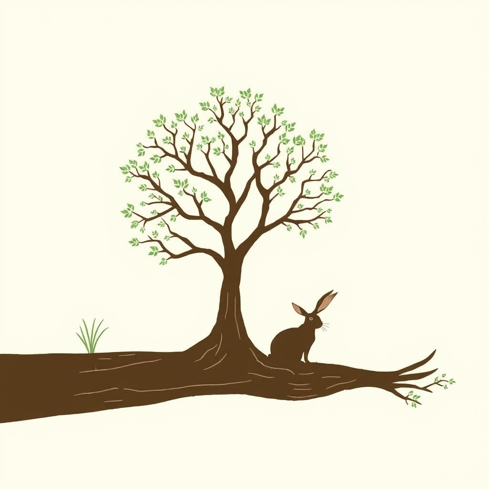

[Home](../index.md) > [Reflections](./index.md) | [⏮️](./2025-11-17.md) [⏭️](./2025-11-19.md)  
# 2025-11-18 | 🌳 Trees | 🐇 Rabbit | ↪️ 180 | 🧠 Intelligences | 🌠 The Star 📚📺🌌  
  
## [📚 Books](../books/index.md)  
- [🌳🗣️ The Hidden Life of Trees: What They Feel, How They Communicate: Discoveries from a Secret World](../books/the-hidden-life-of-trees-what-they-feel-how-they-communicate-discoveries-from-a-secret-world.md)  
- [🐰🥕 The Tale of Peter Rabbit](../books/the-tale-of-peter-rabbit.md)  
  
## [📺 Videos](../videos/index.md)  
- [🏛️🗣️🗓️ Politics Chat, November 18, 2025](../videos/politics-chat-november-18-2025.md)  
- [🧠👶🐒 Alison Gopnik, The Evolution of Human Intelligences | Natural Philosophy Forum Lecture 2025](../videos/alison-gopnik-the-evolution-of-human-intelligences-natural-philosophy-forum-lecture-2025.md)  
  
## [🌌 Topics](../topics/index.md)  
- [⭐✨🌟💫 The Star](../topics/the-star.md)