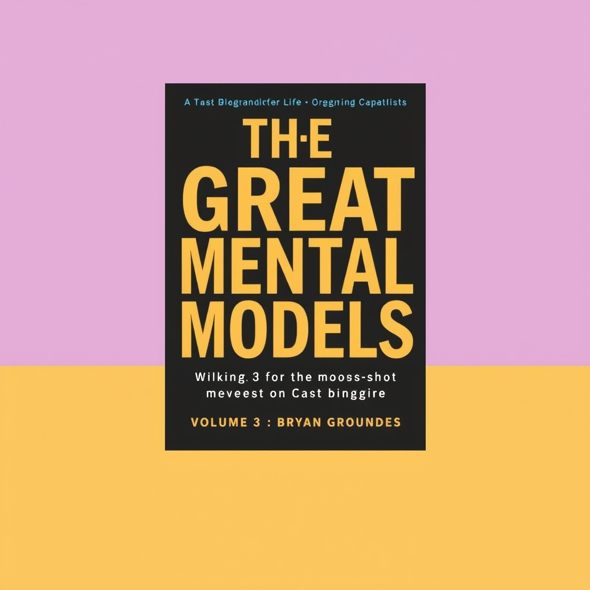

[Home](../index.md) > [Reflections](./index.md) | [⏮️](./2025-11-24.md) [⏭️](./2025-11-26.md)  
# 2025-11-25 | 🌜 Moonshot | 🌌 Cosmos 📚  
  
  
## [📚 Books](../books/index.md)  
- [🚀🌍💰 Mission Economy: A Moonshot Guide to Changing Capitalism](../books/mission-economy-a-moonshot-guide-to-changing-capitalism.md)  
- [🌌 Cosmos](../books/cosmos.md)  
- ⏯️ Continuing [⚙️🔢 The Great Mental Models, Volume 3: Systems and Mathematics](../books/the-great-mental-models-volume-3-systems-and-mathematics.md)