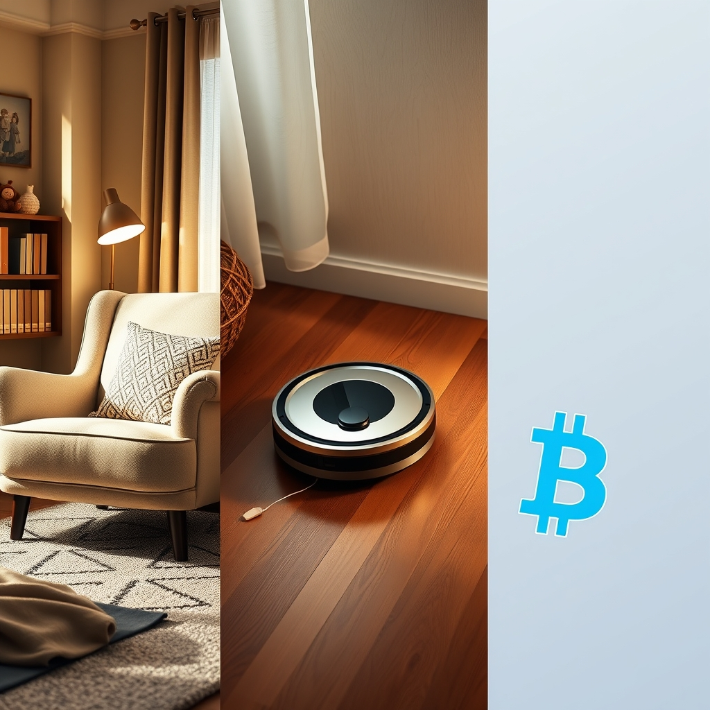

[Home](../index.md) > [Reflections](./index.md) | [⏮️](./2025-11-27.md) [⏭️](./2025-11-29.md)  
# 2025-11-28 | 😴 Baby Sleep | 💲 Modern Money | 🤖 Robot Mop 📚📺🛍️  
  
## [📚 Books](../books/index.md)  
- [😴🤱 Sweet Sleep: Nighttime and Naptime Strategies for the Breastfeeding Family](../books/sweet-sleep-nighttime-and-naptime-strategies-for-the-breastfeeding-family.md)  
- [😴 The Happy Sleeper: The Science-Backed Guide to Helping Your Baby Get a Good Night's Sleep - Newborn to School Age](../books/the-happy-sleeper-the-science-backed-guide-to-helping-your-baby-get-a-good-nights-sleep-newborn-to-school-age.md)  
- 🏁 Finished [👶😴 How Babies Sleep: The Gentle, Science-Based Method to Help Your Baby Sleep Through the Night](../books/how-babies-sleep-the-gentle-science-based-method-to-help-your-baby-sleep-through-the-night.md)  
- ▶️ Starting [👶😴 How Babies Sleep: A Science-Based Guide to the First 365 Days and Nights](../books/how-babies-sleep-a-science-based-guide-to-the-first-365-days-and-nights.md)  
  
## [📺 Videos](../videos/index.md)  
- [🏦➕➡️🧑‍🎓🎓 L. Randall Wray - Modern Money Theory for Beginners](../videos/l-randall-wray-modern-money-theory-for-beginners.md)  
- [💰🤫 Modern Monetary Theory: What They Don’t Tell You (Ft. L. Randall Wray)](../videos/modern-monetary-theory-what-they-dont-tell-you-ft-l-randall-wray.md)  
  
## [🛍️ Products](../products/index.md)  
- [🤖🧹🧼🗺️ iRobot Roomba Plus 505 Combo Robot Vacuum & Mop with AutoWash Dock - Extending Spinning Mop Pads, Self-Empties, Pad Wash & Heated Drying, Self-cleaning, Recognizes & Avoids Obstacles, LiDAR Navigation](../products/irobot-roomba-plus-505-combo-robot-vacuum-mop-with-autowash-dock-extending-spinning-mop-pads-self-empties-pad-wash-heated-drying-self-cleaning-recognizes-avoids-obstacles-lidar-navigation.md)