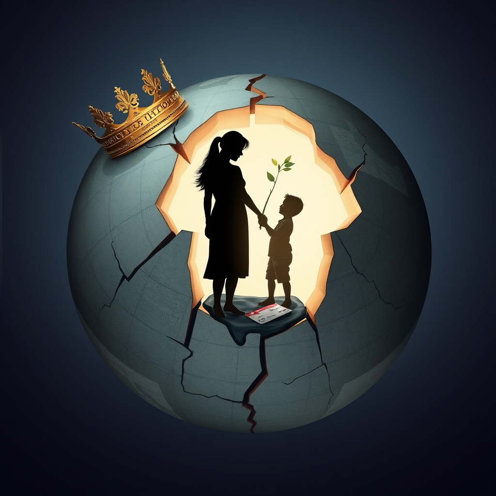

[Home](../index.md) > [Reflections](./index.md) | [⏮️](./2025-12-04.md) [⏭️](./2025-12-06.md)  
# 2025-12-05 | 💳 Credibility | 👑 Autocracy | 🥷 Kleptopia | 🧑‍🧑‍🧒 Parenting 📺📚  
  
  
## [📺 Videos](../videos/index.md)  
- [🇺🇦🤝🤥 Ukraine and America’s Credibility Crisis - with Anne Applebaum](../videos/ukraine-and-americas-credibility-crisis-with-anne-applebaum.md)  
- [👧🧠💪🇯🇵 The Japanese Rule That Teaches Kids Self-Discipline (Not Blind Obedience)](../videos/the-japanese-rule-that-teaches-kids-self-discipline-not-blind-obedience.md)  
  
## [📚 Books](../books/index.md)  
- [👑🌎 Autocracy, Inc.: The Dictators Who Want to Run the World](../books/autocracy-inc-the-dictators-who-want-to-run-the-world.md)  
- [💸🌍 Kleptopia: How Dirty Money Is Conquering the World](../books/kleptopia-how-dirty-money-is-conquering-the-world.md)  
- [❤️🧠 Unconditional Parenting: Moving from Rewards and Punishments to Love and Reason](../books/unconditional-parenting-moving-from-rewards-and-punishments-to-love-and-reason.md)  
- ⏯️ Continuing [🏛️💰 Debt: The First 5,000 Years](../books/debt-the-first-5000-years.md)