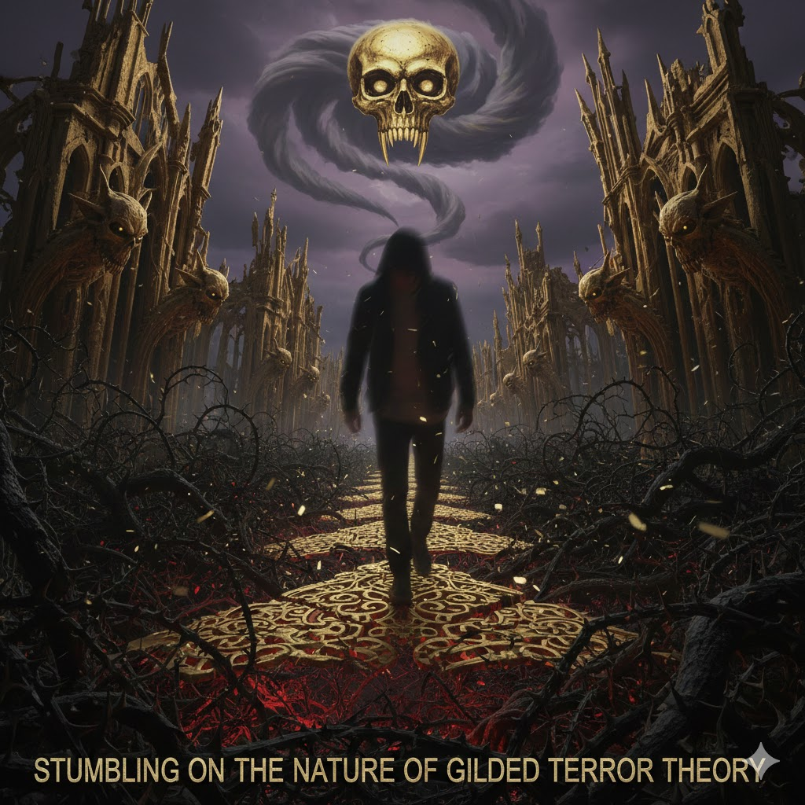

[Home](../index.md) > [Reflections](./index.md) | [⏮️](./2025-12-07.md) [⏭️](./2025-12-09.md)  
# 2025-12-08 | 🏰 Keep 🚧 Stumbling on the 🌿 Nature of 👑 Gilded 😱 Terror 🏫 Theory 📚  
  
  
## [📚 Books](../books/index.md)  
- [💪🧠⏳ The Power of Self-Discipline: 5-Minute Exercises to Build Self-Control, Good Habits, and Keep Going When You Want to Give Up](../books/the-power-of-self-discipline-5-minute-exercises-to-build-self-control-good-habits-and-keep-going-when-you-want-to-give-up.md)  
- [🇺🇸🕵️💥 Playing to the Edge: American Intelligence in the Age of Terror](../books/playing-to-the-edge-american-intelligence-in-the-age-of-terror.md)  
- [👑⚖️ The Curse of Bigness: Antitrust in the New Gilded Age](../books/the-curse-of-bigness-antitrust-in-the-new-gilded-age.md)  
- [⬇️⬆️🧭🌟 Theory U: Leading from the Future as It Emerges](../books/theory-u-leading-from-the-future-as-it-emerges.md)  
- [⚙️🔄 The Nature of Technology: What It Is and How It Evolves](../books/the-nature-of-technology-what-it-is-and-how-it-evolves.md)  
- [😮😊 Stumbling on Happiness](../books/stumbling-on-happiness.md)