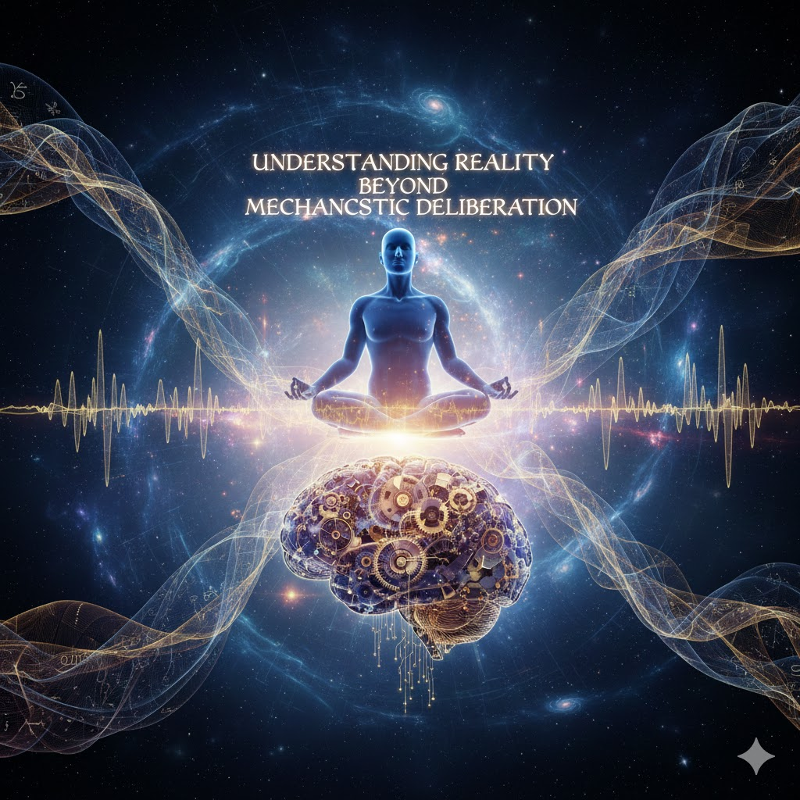

[Home](../index.md) > [Reflections](./index.md) | [⏮️](./2025-12-08.md) [⏭️](./2025-12-10.md)  
# 2025-12-09 | 💡 Understanding 🌎 Reality 🌌 Beyond ⚙️ Mechanistic 🤔 Deliberation ☑️ Is 📍 Near 📚📺✍️  
  
  
## [📚 Books](../books/index.md)  
- [🧬🎭👁️ The Case Against Reality: Why Evolution Hid the Truth from Our Eyes](../books/the-case-against-reality-why-evolution-hid-the-truth-from-our-eyes.md)  
- [🤖🧬⬆️ The Singularity Is Near: When Humans Transcend Biology](../books/the-singularity-is-near-when-humans-transcend-biology.md)  
- [🧠💰🌍 Beyond Growth: The Economics of Sustainable Development](../books/beyond-growth-the-economics-of-sustainable-development.md)  
  
## [📺 Videos](../videos/index.md)  
- [🤔💡🧠🤖 What Is Understanding? – Geoffrey Hinton | IASEAI 2025](../videos/what-is-understanding-geoffrey-hinton-iaseai-2025.md)  
- [🤖💡🤝🗣️🏛️ AI Can Help Humans Find Common Ground in Democratic Deliberation – MH Tessler | IASEAI 2025](../videos/ai-can-help-humans-find-common-ground-in-democratic-deliberation-mh-tessler-iaseai-2025.md)  
- [📚🤖⚙️💡 An Introduction to Mechanistic Interpretability – Neel Nanda | IASEAI 2025](../videos/an-introduction-to-mechanistic-interpretability-neel-nanda-iaseai-2025.md)  
  
## ✍️ Titles  
- [2025-12-07 | ⚖️ Lina Khan’s 🤝 Gentle 🧘‍♀️ Sage Mode 🧠 Intelligence 📜 Guide to 🥊 Punishing 👑 Goliath’s 💰 529 🤿 Deep 🏢 Corporate 🤝 Monopoly 🚢 Boat 💥 Strikes 🌊 While 💧 Drowning in 🗳️ Political 🔒 Prison 🌋 Ashes 📚📺📰](./2025-12-07.md)  
- [2025-12-08 | 🏰 Keep 🚧 Stumbling on the 🌿 Nature of 👑 Gilded 😱 Terror 🏫 Theory 📚](./2025-12-08.md)