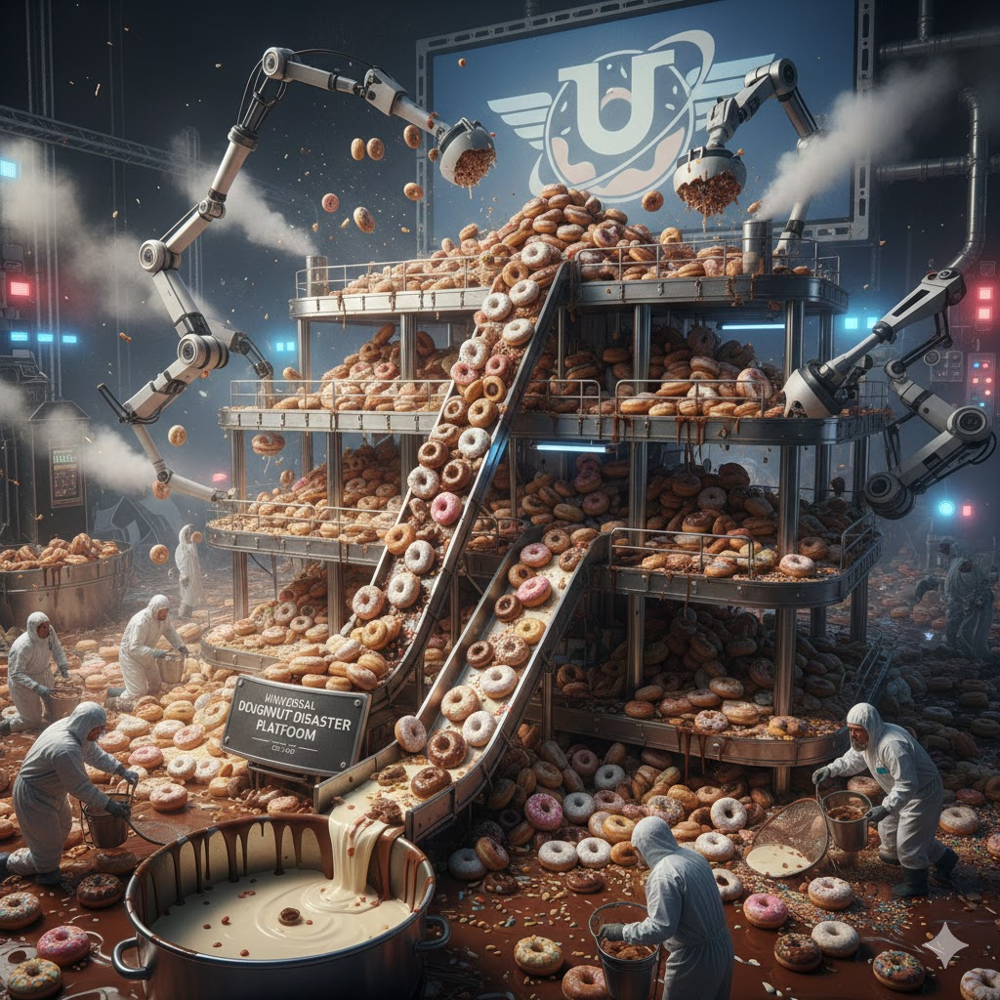

[Home](../index.md) > [Reflections](./index.md) | [⏮️](./2025-12-14.md) [⏭️](./2025-12-16.md)  
# 2025-12-15 | 🌌 Universal 🍩 Doughnut 🌪️ Disaster 📋 Platform 🌌📚  
  
  
## [🌌 Topics](../topics/index.md)  
- [🇺🇸🗣️💡🗓️ A Presidential Platform for Americans 2028](../topics/a-presidential-platform-for-americans-2028.md)  
- [🍎🥛🔬✨ Universal Nutrition System Design](../topics/universal-nutrition-system-design.md)  
  
## [📚 Books](../books/index.md)  
- ⏯️ Continuing [🍩🌍⚖️ Doughnut Economics: Seven Ways to Think Like a 21st-Century Economist](../books/doughnut-economics-seven-ways-to-think-like-a-21st-century-economist.md)  
- [🌍🔥💡 How to Avoid a Climate Disaster: The Solutions We Have and the Breakthroughs We Need](../books/how-to-avoid-a-climate-disaster-the-solutions-we-have-and-the-breakthroughs-we-need.md)  
  
## 🐦 Tweet  
<blockquote class="twitter-tweet" data-theme="dark">
2025-12-15 | 🌌 Universal 🍩 Doughnut 🌪️ Disaster 📋 Platform 🌌📚  🇺🇸🗣️💡🗓️ Political Campaigns | 🍎🥛🔬✨ Food Systems | 🍩🌍⚖️ Economic Models | 🌍🔥💡 Climate Solutions<a href="https://t.co/fCi2EpJr7E">https://t.co/fCi2EpJr7E</a>
&mdash; Bryan Grounds (@bagrounds) <a href="https://twitter.com/bagrounds/status/2000967415895875741?ref_src=twsrc%5Etfw">December 16, 2025</a></blockquote> 