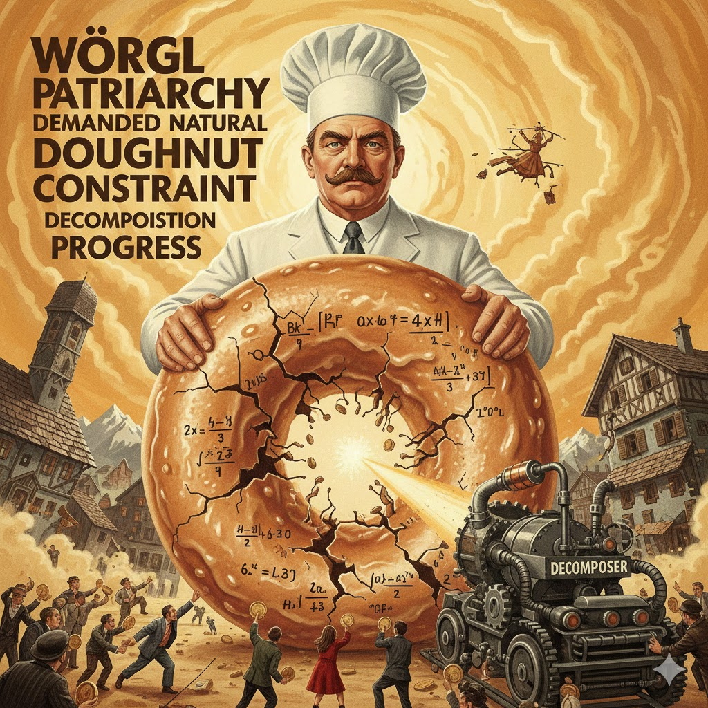

[Home](../index.md) > [Reflections](./index.md) | [⏮️](./2025-12-16.md)  
# 2025-12-17 | 🏔️ Wörgl 🏛️ Patriarchy 📢 Demanded 🌿 Natural 🍩 Doughnut ⛓️ Constraint 🔬 Decomposition 📈 Progress 📚📺📄  
  
  
## [📚 Books](../books/index.md)  
- ⏯️ Continuing [🍩🌍⚖️ Doughnut Economics: Seven Ways to Think Like a 21st-Century Economist](../books/doughnut-economics-seven-ways-to-think-like-a-21st-century-economist.md)  
- [♂️💰♀️🚩 Patriarchy of the Wage: Notes on Marx, Gender, and Feminism](../books/patriarchy-of-the-wage-notes-on-marx-gender-and-feminism.md)  
- [🌿⚙️ The Natural Economic Order](../books/the-natural-economic-order.md)  
- [📈📉 Progress and Poverty](../books/progress-and-poverty.md)  
- [🧩⚙️ Constraint Processing](../books/constraint-processing.md)  
  
## [📺 Videos](../videos/index.md)  
- [🏠👩‍👧‍👦💸💰 The women who demanded wages for housework - Witness History, BBC World Service](../videos/the-women-who-demanded-wages-for-housework-witness-history-bbc-world-service.md)  
- [💰📉🌍 Silvio Gesell's Forgotten Money: The Wörgl Experiment & Demurrage Currency](../videos/silvio-gesells-forgotten-money-the-worgl-experiment-demurrage-currency.md)  
  
## [📄 Articles](../articles/index.md)  
- [🧠🧩🎯⚙️ An Approach for Systematic Decomposition of Complex LLM Tasks](../articles/an-approach-for-systematic-decomposition-of-complex-llm-tasks.md)