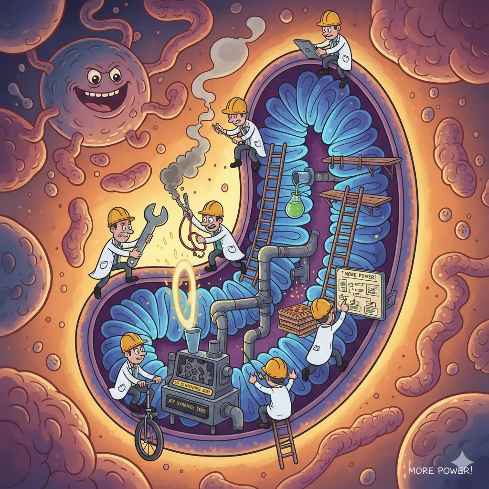

[Home](../index.md) > [Reflections](./index.md) | [⏮️](./2025-12-17.md) [⏭️](./2025-12-19.md)  
# 2025-12-18 | ⚡️ Mitochondria 🔋 Optimization 🛠️ Engineers  
  
  
## [📺 Videos](../videos/index.md)  
- [💡👨‍🔬🏆🚀🌟 How Engineers Break Into The Top 1% | Michael Novati](../videos/how-engineers-break-into-the-top-1-percent-michael-novati.md)  
- [⚡️🔋💪⬆️ Improve Energy & Longevity by Optimizing Mitochondria | Dr. Martin Picard](../videos/improve-energy-longevity-by-optimizing-mitochondria-dr-martin-picard.md)  
  
## [📚 Books](../books/index.md)  
- [⚙️🎯 Algorithms for Optimization](../books/algorithms-for-optimization.md)  
  
## 🐦 Tweet  
<blockquote class="twitter-tweet" data-theme="dark">
2025-12-18 | ⚡️ Mitochondria 🔋 Optimization 🛠️ Engineers  ⚡️ Cellular Powerhouses | 🚀 Performance Enhancement | 🔧 Problem Solving | 🏆 Elite Achievement | 🧑‍🔬 Scientific Research<a href="https://t.co/9uj8gb789t">https://t.co/9uj8gb789t</a>
&mdash; Bryan Grounds (@bagrounds) <a href="https://twitter.com/bagrounds/status/2003189761889247237?ref_src=twsrc%5Etfw">December 22, 2025</a></blockquote> 