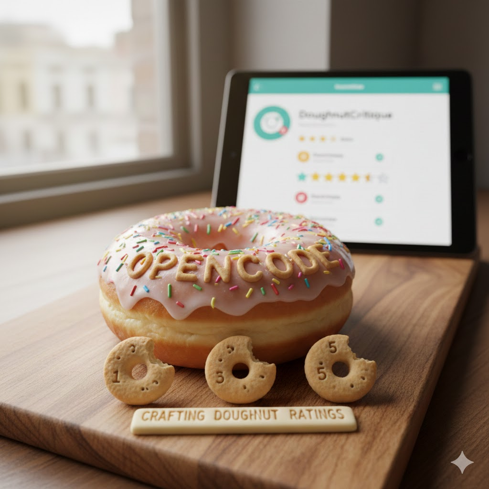

[Home](../index.md) > [Reflections](./index.md) | [⏮️](./2025-12-18.md) [⏭️](./2025-12-20.md)  
# 2025-12-19 | 💻 OpenCode 🛠️ Crafting 🍩 Doughnut 👍 Ratings 💾📰📚  
  
  
## [💾 Software](../software/index.md)  
- [💻🔓 OpenCode](../software/opencode.md)  
  
## 📰 News  
- [📣📊🧠 Brooks and Capehart on Trump's approval ratings and mental acuity](../videos/brooks-and-capehart-on-trumps-approval-ratings-and-mental-acuity.md)  
  
## [📚 Books](../books/index.md)  
- [✨🤖🔗🐍 Generative AI with LangChain: A Hands On Guide to Crafting Scalable, Intelligent Systems and Advanced AI Agents with Python](../books/generative-ai-with-langchain-a-hands-on-guide-to-crafting-scalable-intelligent-systems-and-advanced-ai-agents-with-python.md)  
- ⏯️ Continuing [🍩🌍⚖️ Doughnut Economics: Seven Ways to Think Like a 21st-Century Economist](../books/doughnut-economics-seven-ways-to-think-like-a-21st-century-economist.md)  
  
## 🐦 Tweet  
<blockquote class="twitter-tweet" data-theme="dark">
2025-12-19 | 💻 OpenCode 🛠️ Crafting 🍩 Doughnut 👍 Ratings 💾📰📚  🔓 Open Source Software | 🧠 Generative AI | 📈 Political Opinion | 🌎 Economic Models<a href="https://t.co/puVDT0St4a">https://t.co/puVDT0St4a</a>
&mdash; Bryan Grounds (@bagrounds) <a href="https://twitter.com/bagrounds/status/2003190063384195214?ref_src=twsrc%5Etfw">December 22, 2025</a></blockquote>   
  
## 🦋 Bluesky    
<blockquote class="bluesky-embed" data-bluesky-uri="at://did:plc:i4yli6h7x2uoj7acxunww2fc/app.bsky.feed.post/3muyvusb6zy2m" data-bluesky-cid="bafyreieoyookkictqplt77uderrzn3cm5dgnawv5i7udk4awwdwbahd4oq">
2025-12-19 | 💻 OpenCode 🛠️ Crafting 🍩 Doughnut 👍 Ratings 💾📰📚  
  
#AI Q: 🍩 Can economic success exist without endless growth?  
  
🔓 Open Source | 🤖 Large Language Models | 📈 Political Analysis | 🌍 Sustainable Systems  
https://bagrounds.org/reflections/2025-12-19
&mdash; <a href="https://bsky.app/profile/did:plc:i4yli6h7x2uoj7acxunww2fc?ref_src=embed">Bryan Grounds (@bagrounds.bsky.social)</a> <a href="https://bsky.app/profile/did:plc:i4yli6h7x2uoj7acxunww2fc/post/3muyvusb6zy2m?ref_src=embed">2026-09-08T11:23:07.000Z</a></blockquote>