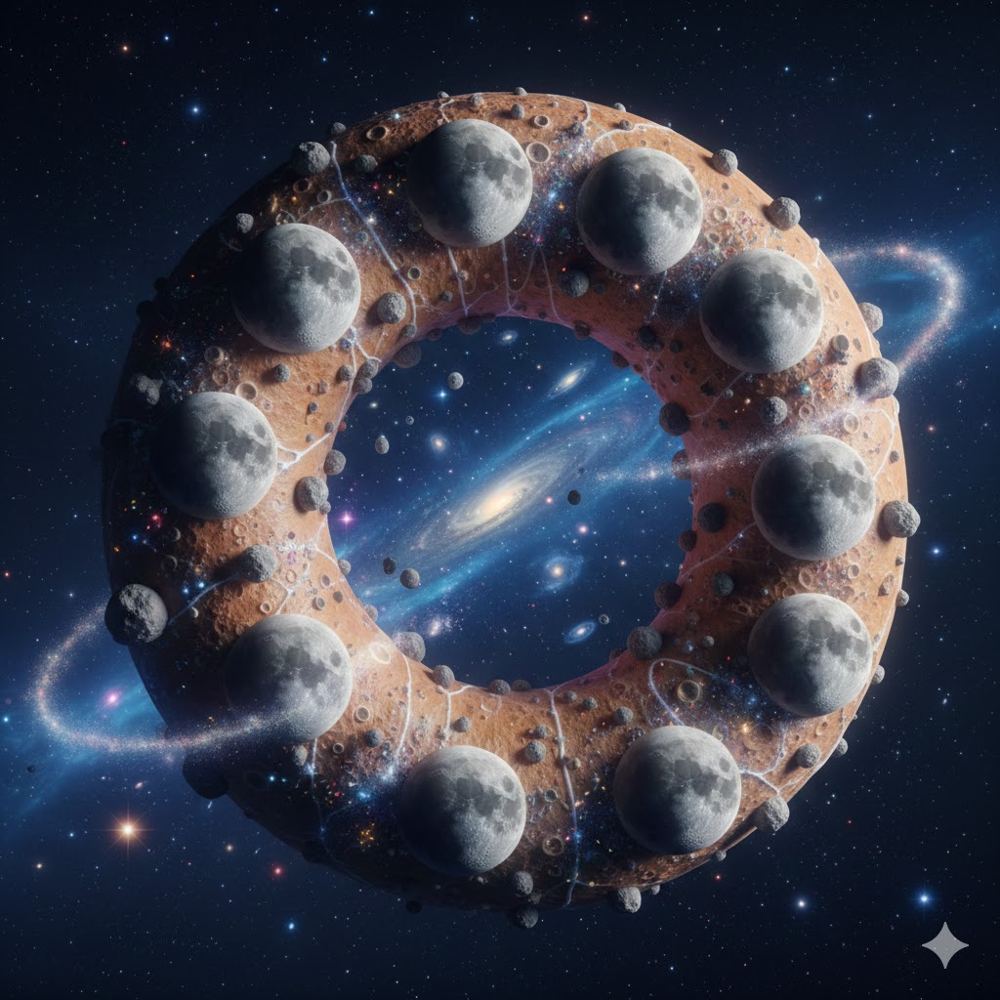

[Home](../index.md) > [Reflections](./index.md) | [⏮️](./2025-12-20.md) [⏭️](./2025-12-22.md)  
# 2025-12-21 | ♾️ Infinite 🌙 Moon 🍩 Doughnut 📺📚  
  
  
## [📺 Videos](../videos/index.md)  
- [♾️🐛💻 The Infinite Software Crisis – Jake Nations, Netflix](../videos/the-infinite-software-crisis-jake-nations-netflix.md)  
  
## [📚 Books](../books/index.md)  
- [🌙🛌 Goodnight Moon](../books/goodnight-moon.md)  
- ⏯️ Continuing [🍩🌍⚖️ Doughnut Economics: Seven Ways to Think Like a 21st-Century Economist](../books/doughnut-economics-seven-ways-to-think-like-a-21st-century-economist.md)  
  
## 🐦 Tweet  
<blockquote class="twitter-tweet" data-theme="dark">
2025-12-21 | ♾️ Infinite 🌙 Moon 🍩 Doughnut 📺📚  🌙 Children&#39;s Literature | 🍩 Economic Theory | 🐛 Software Development | ⚖️ Sustainable Economics<a href="https://t.co/lQDRJANxSs">https://t.co/lQDRJANxSs</a>
&mdash; Bryan Grounds (@bagrounds) <a href="https://twitter.com/bagrounds/status/2003190821777211508?ref_src=twsrc%5Etfw">December 22, 2025</a></blockquote>   
  
## 🦋 Bluesky    
<blockquote class="bluesky-embed" data-bluesky-uri="at://did:plc:i4yli6h7x2uoj7acxunww2fc/app.bsky.feed.post/3mtb6yjopxi2z" data-bluesky-cid="bafyreihrdz4drmog6fketzce673fspa7l3knvye7ieh5sesa2r2y7m56ji">
2025-12-21 | ♾️ Infinite 🌙 Moon 🍩 Doughnut 📺📚  
  
#AI Q: 🍩 Can simple children&#39;s stories teach better economic lessons than complex textbooks?  
  
💻 Engineering Challenges | 🧸 Bedtime Stories | 🌍 Sustainable Growth  
https://bagrounds.org/reflections/2025-12-21
&mdash; <a href="https://bsky.app/profile/did:plc:i4yli6h7x2uoj7acxunww2fc?ref_src=embed">Bryan Grounds (@bagrounds.bsky.social)</a> <a href="https://bsky.app/profile/did:plc:i4yli6h7x2uoj7acxunww2fc/post/3mtb6yjopxi2z?ref_src=embed">2026-08-17T07:37:10.000Z</a></blockquote>