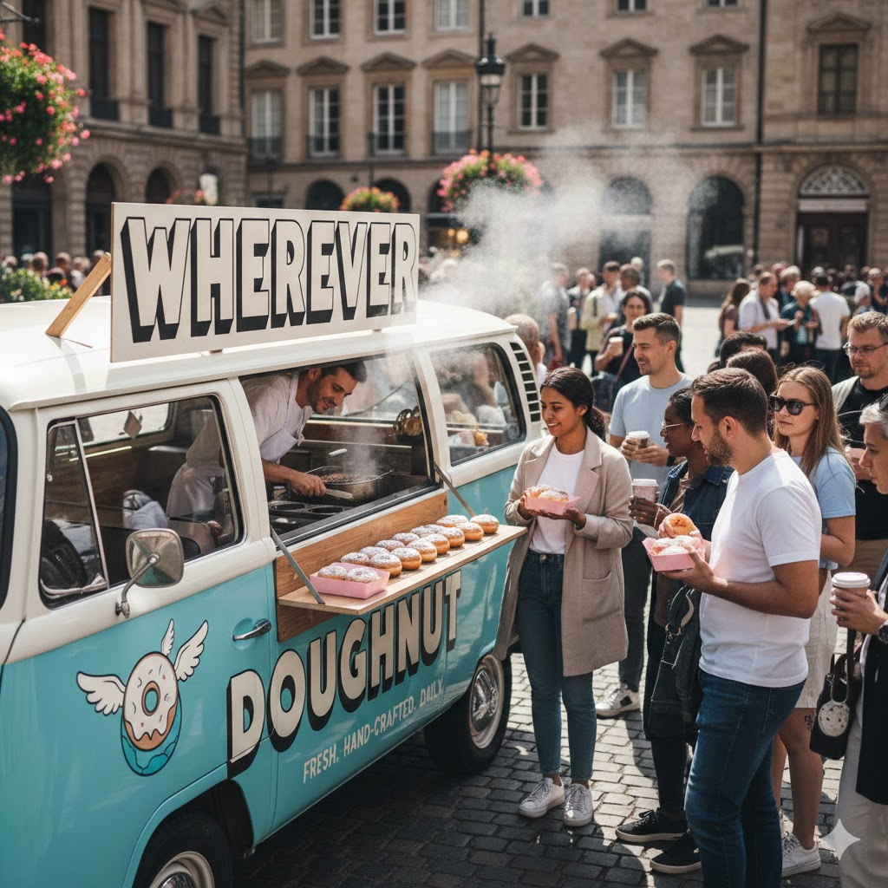

[Home](../index.md) > [Reflections](./index.md) | [⏮️](./2025-12-21.md) [⏭️](./2025-12-23.md)  
# 2025-12-22 | 🌍 Wherever 🍩 Doughnut 📚  
  
  
## [📚 Books](../books/index.md)  
- ⏯️ Continuing [👣➡️🌍 Wherever You Go, There You Are](../books/wherever-you-go-there-you-are.md)  
- ⏯️ Continuing [🍩🌍⚖️ Doughnut Economics: Seven Ways to Think Like a 21st-Century Economist](../books/doughnut-economics-seven-ways-to-think-like-a-21st-century-economist.md)  
  
## 🤖🐲 AI Fiction  
🌟 The aroma of freshly baked doughnuts 🍩 mingled with the morning air ☀️ in the bustling town square 🏘️, a scent that had become a comforting staple 🥰 for the residents of Oakhaven. At the heart of it all was "Wherever Doughnut," a charming, sky-blue vintage food truck 🚚, its side adorned with a whimsical winged doughnut logo 🕊️.  
  
✨ Behind the counter, Elias, the truck's owner and sole baker 🧑‍🍳, worked with practiced ease. He greeted each customer 👋 with a warm smile 😊 and a sprinkle of good humor 😂, serving up his delectable creations: classic glazed 🌟, blueberry fritters 🫐, and his famous maple-bacon wonders 🥓🍁.  
  
💭 Today, a young woman named Maya stood in line, a thoughtful expression on her face 🤔. She was new to Oakhaven, having moved for a job 💼 that, so far, felt more like a chore 😓 than a career. She missed the spontaneity of her old life, the feeling of discovery ✨.  
  
🗣️ As she stepped up to the window, Elias winked 😉. "Lost in thought, or just overwhelmed by the delicious possibilities? 🤩"  
  
😂 Maya chuckled, "A bit of both, I suppose. I'll take a classic glazed, please. 🙏"  
  
🤝 As Elias handed her the doughnut, he noticed her wistful gaze at the "Wherever" sign. "You know," he said, "I named it that because I believe a good doughnut 🍩 can make any place feel a little more like home 🏡, a little more like an adventure. 🚀"  
  
😋 Maya took a bite of the warm, fluffy doughnut, and a small smile touched her lips 😊. It was perfect. ✨ "It's a lovely idea," she admitted. 💖  
  
🌠 "Every day is a new journey," Elias continued, "and every doughnut is a small reminder to enjoy the ride 🎢, wherever it takes you. 🌍"  
  
💡 Inspired by his simple philosophy 🤔 and the unexpected sweetness of the moment 🥰, Maya decided right then that she wouldn't just go through the motions in Oakhaven. She would explore it 🗺️, embrace it 🤗, and perhaps, like Elias's doughnuts, find a way to make her mark 🏆, wherever she was. With a renewed spring in her step 🚶‍♀️ and the lingering taste of pure delight 🤤, Maya walked away, ready to discover the adventures 🤩 that awaited her in Oakhaven, one delicious day at a time. 🌈  
  
## 🐦 Tweet  
<blockquote class="twitter-tweet" data-theme="dark">
2025-12-22 | 🌍 Wherever 🍩 Doughnut 📚  🍩 Doughnut Economics | 🚗 Food Truck Narrative | ✨ Personal Growth | 🗺️ Local Exploration<a href="https://t.co/ia3Ggryt9l">https://t.co/ia3Ggryt9l</a>
&mdash; Bryan Grounds (@bagrounds) <a href="https://twitter.com/bagrounds/status/2004609135929856005?ref_src=twsrc%5Etfw">December 26, 2025</a></blockquote> 