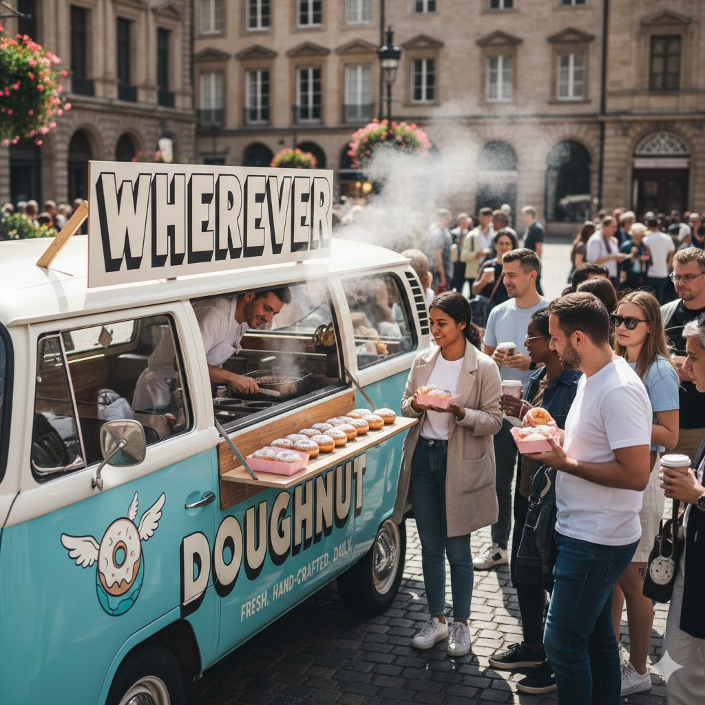

[Home](../index.md) > [Reflections](./index.md) | [⏮️](./2025-12-21.md) [⏭️](./2025-12-23.md)  
# 2025-12-22 | 🌍 Wherever 🍩 Doughnut 📚  
  
  
## [📚 Books](../books/index.md)  
- ⏯️ Continuing [👣➡️🌍 Wherever You Go, There You Are](../books/wherever-you-go-there-you-are.md)  
- ⏯️ Continuing [🍩🌍⚖️ Doughnut Economics: Seven Ways to Think Like a 21st-Century Economist](../books/doughnut-economics-seven-ways-to-think-like-a-21st-century-economist.md)  
  
## 🤖🐲 AI Fiction  
🌟 The aroma of freshly baked doughnuts 🍩 mingled with the morning air ☀️ in the bustling town square 🏘️, a scent that had become a comforting staple 🥰 for the residents of Oakhaven. At the heart of it all was "Wherever Doughnut," a charming, sky-blue vintage food truck 🚚, its side adorned with a whimsical winged doughnut logo 🕊️.  
  
✨ Behind the counter, Elias, the truck's owner and sole baker 🧑‍🍳, worked with practiced ease. He greeted each customer 👋 with a warm smile 😊 and a sprinkle of good humor 😂, serving up his delectable creations: classic glazed 🌟, blueberry fritters 🫐, and his famous maple-bacon wonders 🥓🍁.  
  
💭 Today, a young woman named Maya stood in line, a thoughtful expression on her face 🤔. She was new to Oakhaven, having moved for a job 💼 that, so far, felt more like a chore 😓 than a career. She missed the spontaneity of her old life, the feeling of discovery ✨.  
  
🗣️ As she stepped up to the window, Elias winked 😉. "Lost in thought, or just overwhelmed by the delicious possibilities? 🤩"  
  
😂 Maya chuckled, "A bit of both, I suppose. I'll take a classic glazed, please. 🙏"  
  
🤝 As Elias handed her the doughnut, he noticed her wistful gaze at the "Wherever" sign. "You know," he said, "I named it that because I believe a good doughnut 🍩 can make any place feel a little more like home 🏡, a little more like an adventure. 🚀"  
  
😋 Maya took a bite of the warm, fluffy doughnut, and a small smile touched her lips 😊. It was perfect. ✨ "It's a lovely idea," she admitted. 💖  
  
🌠 "Every day is a new journey," Elias continued, "and every doughnut is a small reminder to enjoy the ride 🎢, wherever it takes you. 🌍"  
  
💡 Inspired by his simple philosophy 🤔 and the unexpected sweetness of the moment 🥰, Maya decided right then that she wouldn't just go through the motions in Oakhaven. She would explore it 🗺️, embrace it 🤗, and perhaps, like Elias's doughnuts, find a way to make her mark 🏆, wherever she was. With a renewed spring in her step 🚶‍♀️ and the lingering taste of pure delight 🤤, Maya walked away, ready to discover the adventures 🤩 that awaited her in Oakhaven, one delicious day at a time. 🌈  
  
## 🐦 Tweet  
<blockquote class="twitter-tweet" data-theme="dark">
2025-12-22 | 🌍 Wherever 🍩 Doughnut 📚  🍩 Doughnut Economics | 🚗 Food Truck Narrative | ✨ Personal Growth | 🗺️ Local Exploration<a href="https://t.co/ia3Ggryt9l">https://t.co/ia3Ggryt9l</a>
&mdash; Bryan Grounds (@bagrounds) <a href="https://twitter.com/bagrounds/status/2004609135929856005?ref_src=twsrc%5Etfw">December 26, 2025</a></blockquote>   
  
## 🦋 Bluesky    
<blockquote class="bluesky-embed" data-bluesky-uri="at://did:plc:i4yli6h7x2uoj7acxunww2fc/app.bsky.feed.post/3mswxh5z2k32p" data-bluesky-cid="bafyreib6bxgej4hjfntnbzxmj2oycu5xfw34m447lkqzu7mjzfrduz254e">
2025-12-22 | 🌍 Wherever 🍩 Doughnut 📚  
  
#AI Q: 🍩 Which small daily ritual helps turn a new place into home?  
  
🧘‍♀️ Mindfulness | 🌍 Ecological Economics | 🚚 Food Truck Story | 🌱 Personal Growth  
https://bagrounds.org/reflections/2025-12-22
&mdash; <a href="https://bsky.app/profile/did:plc:i4yli6h7x2uoj7acxunww2fc?ref_src=embed">Bryan Grounds (@bagrounds.bsky.social)</a> <a href="https://bsky.app/profile/did:plc:i4yli6h7x2uoj7acxunww2fc/post/3mswxh5z2k32p?ref_src=embed">2026-08-13T05:55:34.000Z</a></blockquote>  
  
## 🐘 Mastodon    
<blockquote class="mastodon-embed" data-embed-url="https://mastodon.social/@bagrounds/117104442675395667/embed" style="background: #282c37; border-radius: 8px; border: 1px solid #393f4f; margin: 0; max-width: 540px; min-width: 270px; overflow: hidden; padding: 0;"> <a href="https://mastodon.social/@bagrounds/117104442675395667" target="_blank" style="align-items: center; color: #d9e1e8; display: flex; flex-direction: column; font-family: system-ui, -apple-system, BlinkMacSystemFont, 'Segoe UI', Oxygen, Ubuntu, Cantarell, 'Fira Sans', 'Droid Sans', 'Helvetica Neue', Roboto, sans-serif; font-size: 14px; justify-content: center; letter-spacing: 0.25px; line-height: 20px; padding: 24px; text-decoration: none;"> <svg xmlns="http://www.w3.org/2000/svg" xmlns:xlink="http://www.w3.org/1999/xlink" width="32" height="32" viewBox="0 0 79 75"><path d="M63 45.3v-20c0-4.1-1-7.3-3.2-9.7-2.1-2.4-5-3.7-8.5-3.7-4.1 0-7.2 1.6-9.3 4.7l-2 3.3-2-3.3c-2-3.1-5.1-4.7-9.2-4.7-3.5 0-6.4 1.3-8.6 3.7-2.1 2.4-3.1 5.6-3.1 9.7v20h8V25.9c0-4.1 1.7-6.2 5.2-6.2 3.8 0 5.8 2.5 5.8 7.4V37.7H44V27.1c0-4.9 1.9-7.4 5.8-7.4 3.5 0 5.2 2.1 5.2 6.2V45.3h8ZM74.7 16.6c.6 6 .1 15.7.1 17.3 0 .5-.1 4.8-.1 5.3-.7 11.5-8 16-15.6 17.5-.1 0-.2 0-.3 0-4.9 1-10 1.2-14.9 1.4-1.2 0-2.4 0-3.6 0-4.8 0-9.7-.6-14.4-1.7-.1 0-.1 0-.1 0s-.1 0-.1 0 0 .1 0 .1 0 0 0 0c.1 1.6.4 3.1 1 4.5.6 1.7 2.9 5.7 11.4 5.7 5 0 9.9-.6 14.8-1.7 0 0 0 0 0 0 .1 0 .1 0 .1 0 0 .1 0 .1 0 .1.1 0 .1 0 .1.1v5.6s0 .1-.1.1c0 0 0 0 0 .1-1.6 1.1-3.7 1.7-5.6 2.3-.8.3-1.6.5-2.4.7-7.5 1.7-15.4 1.3-22.7-1.2-6.8-2.4-13.8-8.2-15.5-15.2-.9-3.8-1.6-7.6-1.9-11.5-.6-5.8-.6-11.7-.8-17.5C3.9 24.5 4 20 4.9 16 6.7 7.9 14.1 2.2 22.3 1c1.4-.2 4.1-1 16.5-1h.1C51.4 0 56.7.8 58.1 1c8.4 1.2 15.5 7.5 16.6 15.6Z" fill="currentColor"/></svg> 
Post by @bagrounds@mastodon.social
 
View on Mastodon
 </a> </blockquote> 