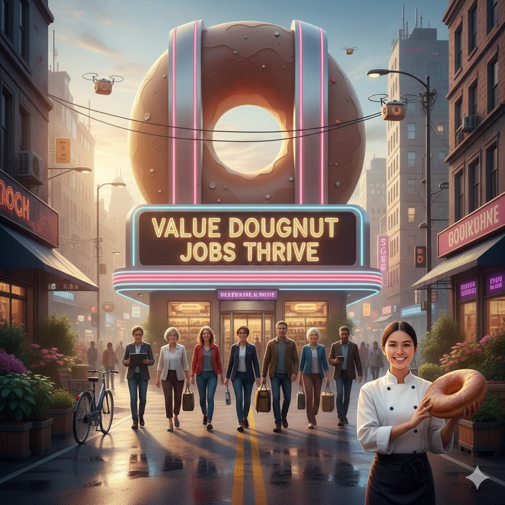

[Home](../index.md) > [Reflections](./index.md) | [⏮️](./2025-12-22.md) [⏭️](./2025-12-24.md)  
# 2025-12-23 | 💎 Value 🍩 Doughnut 💼 Jobs 🌱 Thrive 📚📺  
  
  
## [📚 Books](../books/index.md)  
- [💰🏭🌍 The Value of Everything: Making and Taking in the Global Economy](../books/the-value-of-everything-making-and-taking-in-the-global-economy.md)  
- ⏯️ Continuing [🍩🌍⚖️ Doughnut Economics: Seven Ways to Think Like a 21st-Century Economist](../books/doughnut-economics-seven-ways-to-think-like-a-21st-century-economist.md)  
- [📈💼 The New Geography of Jobs](../books/the-new-geography-of-jobs.md)  
  
## [📺 Videos](../videos/index.md)  
- [🌱📈✅➡️🔄 A healthy economy should be designed to thrive, not grow | Kate Raworth](../videos/a-healthy-economy-should-be-designed-to-thrive-not-grow-kate-raworth.md)  
  
## 🤖🐲 AI Fiction  
✨The neon glow of "Value Doughnut Jobs Thrive" cast a warm, inviting light down the alley. 🌃 It was a street that had once seen better days, but now, thanks to the vision of entrepreneur Clara Bell 👩‍🍳, it hummed with renewed life. 🎶  
  
Clara, a young woman with a passion for baking 🍩 and a keen eye for community 🤝, stood proudly at the entrance of her flagship store, holding a perfectly golden, freshly glazed doughnut. 🤤 "It's more than just a pastry," she often said, "it's an opportunity." 🚀  
  
And indeed it was. 💯 The "Value Doughnut" wasn't just about affordable treats 💰; it was about the ecosystem it supported. 🌳 A diverse group of people—from recent graduates 🧑‍🎓 to seasoned professionals looking for a fresh start 🌟—walked purposefully toward the shop. 🚶‍♀️🚶‍♂️ They were the new hires, drawn by Clara’s commitment to fair wages ⚖️ and a supportive environment. 🤗 There were bakers 👨‍🍳, logistics coordinators 🚚, and even drone operators 🚁 for the increasingly popular aerial deliveries buzzing above the city. 🏙️  
  
Inside the bustling shop 🏬, the aroma of cinnamon 🍂 and sugar 🍬 filled the air. One of the new recruits, a former analyst named David, carefully arranged a display of rainbow-sprinkled delights. 🌈 He’d traded a sterile cubicle 🏢 for a baker’s apron, and he’d never been happier. 😄 "Who knew the path to fulfillment was paved with dough?" 🤔 he chuckled. 😂  
  
Clara watched it all, a smile playing on her lips. 😊 She had proven that a business built on value—not just in its product 💯, but in its people 👨‍👩‍👧‍👦—could truly thrive. 🌱 As the sun began to set 🌅, the glowing sign above the alley seemed to shine even brighter ✨, a beacon of hope 🙏 and steady work 💼 for the whole neighborhood. 🏘️