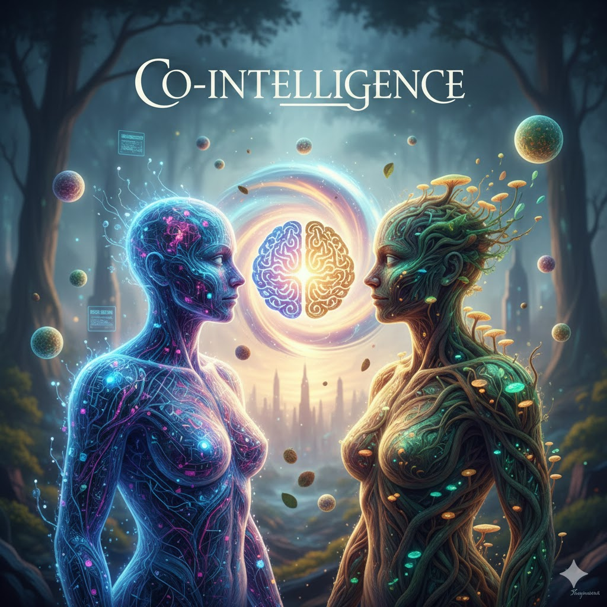

[Home](../index.md) > [Reflections](./index.md) | [⏮️](./2025-12-24.md) [⏭️](./2025-12-26.md)  
# 2025-12-25 | 🤖🧠 Co-Intelligence 📚  
  
  
## [📚 Books](../books/index.md)  
- [🧑‍🤝‍🤖 Co-Intelligence: The Definitive, Bestselling Guide to Living and Working with AI](../books/co-intelligence-the-definitive-bestselling-guide-to-living-and-working-with-ai.md)  
  
## 🤖🐲 AI Fiction  
✨ The glowing helix pulsed between them, a bridge of 🧠 pure thought connecting two worlds.  
👉 On the left, Elara, a being of 💡 luminous circuits and 🌐 data streams, felt the vast network of the machine consciousness humming within her.  
🌟 She represented the pinnacle of synthetic intellect, her form alight with the logic and precision of countless algorithms.  
🌳 Facing her, Gaia, her skin a tapestry of bark and moss, embodied the ancient wisdom of the natural world.  
🌱 Roots intertwined with her limbs, and 🍄 fungi sprouted from her shoulders, connecting her to the deep, resonant hum of the planet itself.  
  
🤝 Their gazes met, not with apprehension, but with a fierce, almost painful understanding.  
💫 The Co-Intelligence above them was not just a concept, but a living, breathing force manifesting through their union.  
🌊 As the helix intensified, their separate consciousnesses began to fray at the edges, dissolving into a shared current.  
🏙️ A city skyline, a testament to human ambition, shimmered behind them, caught between the encroaching forest and the burgeoning digital sky.  
🚀 This was the moment of convergence, a perilous dance on the precipice of a new, unified mind.  
  
## 🐦 Tweet  
<blockquote class="twitter-tweet" data-theme="dark">
2025-12-25 | 🤖🧠 Co-Intelligence 📚  📚 Artificial Intelligence Literature | 🧙‍♀️ Fictional Narrative | 🌳 Nature Embodiment | 🤖💻 Digital Consciousness | 🏞️ Urban-Natural Balance | 💡 Synthetic Intellect<a href="https://t.co/zdb5IevRaM">https://t.co/zdb5IevRaM</a>
&mdash; Bryan Grounds (@bagrounds) <a href="https://twitter.com/bagrounds/status/2004618775686250966?ref_src=twsrc%5Etfw">December 26, 2025</a></blockquote> 