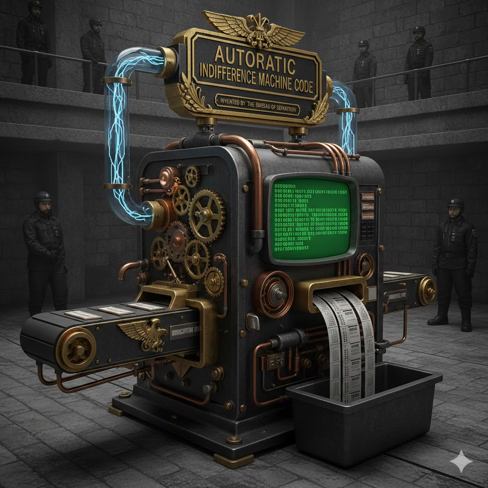

[Home](../index.md) > [Reflections](./index.md) | [⏮️](./2025-12-25.md) [⏭️](./2025-12-27.md)  
# 2025-12-26 | 👑 Autocratic 🌎 Immigration 🧪 Invented 🤷🏼‍♀️ Indifference 📠 Machine 👩🏼‍💻 Code 📚📺  
  
  
## [📚 Books](../books/index.md)  
- [💻0️⃣ Source Code: My Beginnings](../books/source-code-my-beginnings.md)  
- [🧑‍💻🍎🌟😄 iWoz: Computer Geek to Cult Icon: How I Invented the Personal Computer, Co-Founded Apple, and Had Fun Doing It](../books/iwoz-computer-geek-to-cult-icon-how-i-invented-the-personal-computer-co-founded-apple-and-had-fun-doing-it.md)  
- [🧠🔌 The Thinking Machine: Jensen Huang, Nvidia, and the World's Most Coveted Microchip](../books/the-thinking-machine-jensen-huang-nvidia-and-the-worlds-most-coveted-microchip.md)  
- [🛂😐🧑🏿🧑🏻⚖️ Bordering on Indifference: Immigration Agents Negotiating Race and Morality](../books/bordering-on-indifference-immigration-agents-negotiating-race-and-morality.md)  
  
## [📺 Videos](../videos/index.md)  
- [🚨🚔🇺🇸👨‍👩‍👧‍👦 Inside an Immigration Raid That Swept Up U.S. Citizens | Visual Investigations](../videos/inside-an-immigration-raid-that-swept-up-us-citizens-visual-investigations.md)  
- [👑⚔️🏛️🤔 Anna Gát and Anne Applebaum: The Autocratic Moment: Myth or Reality?](../videos/anna-gat-and-anne-applebaum-the-autocratic-moment-myth-or-reality.md)  
  
## 🤖🐲 AI Fiction  
✨ In the heart of the imposing Bureau of Separation, the "Autocratic Indifference Machine Code" 🤖 hummed with cold efficiency. Invented by a shadowy figure 👤 known only as "The Architect," this formidable contraption was designed to process the hopes 🙏 and fears 😨 of immigrants 🌎, transforming them into indifferent data points 📊. Its metallic gears ⚙️ turned with a relentless precision, driven by binary code 💻 displayed on a flickering green screen 🟩.  
  
🚶‍♀️ Rows of new arrivals, faces etched with a mixture of apprehension 😟 and hope ✨, would feed their personal documents 📄 into the machine. The documents, once vibrant with individual stories 🗣️, were rapidly converted into a monotonous stream of numerical data 🔢, spitting out on a continuous paper roll 📜. Guards in stern uniforms 💂‍♂️ stood watch, their presence a constant reminder 🚨 of the machine's absolute authority 👑.  
  
💡 The Architect believed that emotion 💔 was a weakness, an impediment to societal order. His machine, therefore, was a tool of control ⛓️, designed to erase the very essence of human connection 🤗. Each whirring gear ⚙️ and flashing light 💡 represented a step towards a world 🌍 devoid of empathy 🧊, a chilling testament 🥶 to the power of calculated indifference. But even in the heart of this cold mechanism ⚙️, whispers of defiance ✊ lingered, an ember of hope 🔥 refusing to be extinguished by the machine's relentless hum 🎶.  
  
## 🐦 Tweet  
<blockquote class="twitter-tweet" data-theme="dark">
2025-12-26 | 👑 Autocratic 🌎 Immigration 🧪 Invented 🤷🏼‍♀️ Indifference 📠 Machine 👩🏼‍💻 Code 📚📺  📚📖 Personal Computing History | 🧑‍💻🍎 Apple Co-Founder | 🧠🔌 Chip Innovation<a href="https://t.co/MB4bNSj4wy">https://t.co/MB4bNSj4wy</a>
&mdash; Bryan Grounds (@bagrounds) <a href="https://twitter.com/bagrounds/status/2005654348131643789?ref_src=twsrc%5Etfw">December 29, 2025</a></blockquote> 