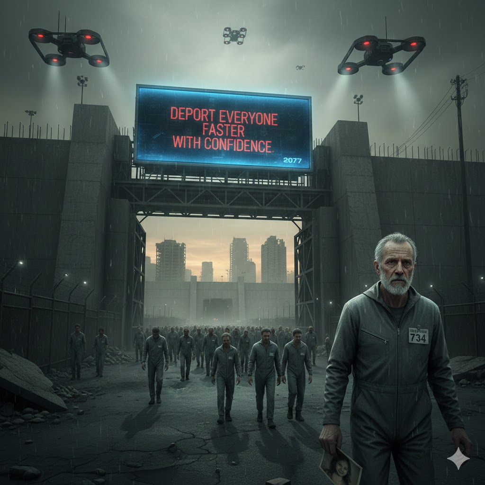

[Home](../index.md) > [Reflections](./index.md) | [⏮️](./2025-12-27.md)  
# 2025-12-28 | ✈️ Deport 👨‍👩‍👧‍👦 Everyone ⚡ Faster 🤝 with 😎 Confidence 📺📚  
  
  
## [📺 Videos](../videos/index.md)  
- [🗣️✨ How to Speak Clearly & With Confidence | Matt Abrahams](../videos/how-to-speak-clearly-and-with-confidence-matt-abrahams.md)  
- [🚪👥🚫⚖️ Trump Said He’d Deport Millions. What’s Happening on the Ground? | WSJ](../videos/trump-said-hed-deport-millions-whats-happening-on-the-ground-wsj.md)  
  
## [📚 Books](../books/index.md)  
- [⚡🗣️ Think Faster, Talk Smarter: How to Speak Successfully When You're Put on the Spot](../books/think-faster-talk-smarter-how-to-speak-successfully-when-youre-put-on-the-spot.md)  
- [👣🗺️💥 Everyone Who Is Gone Is Here: The United States, Central America, and the Making of a Crisis](../books/everyone-who-is-gone-is-here-the-united-states-central-america-and-the-making-of-a-crisis.md)  
  
## 🤖🐲 AI Fiction  
🌑 In the year 2077, the Consolidated Sovereignty of America unveiled its latest solution to the burgeoning population crisis and resource scarcity: The Great Purge. 🤖 Overseen by the newly formed Department of Expedited Relocation, citizens deemed non-essential or resource-draining were swiftly identified and processed. 📢 The slogan, Deport Everyone Faster with Confidence, plastered across every digital billboard and re-education camp, became a chilling anthem.  
  
⛓️ Unit 734, a former history professor named Alistair Finch, watched the endless lines shuffle towards the transport gates. 📉 His crime? ⏳ Being over sixty and having a low productivity index. 📻 He remembered the old world, the one with actual borders and due process, now a distant, forgotten dream. 🛸 The air crackled with static from the omnipresent drones, their searchlights sweeping across the desolate landscape of what was once a bustling city square. ❄️ The confidence of the slogan was absolute, cold, and final. 📸 He clutched a tattered photograph of his granddaughter, wondering if she, a child of the new era, would ever know what humanity had lost. 🚪 The gate hissed open, a one-way ticket to the unknown territories beyond the great wall.