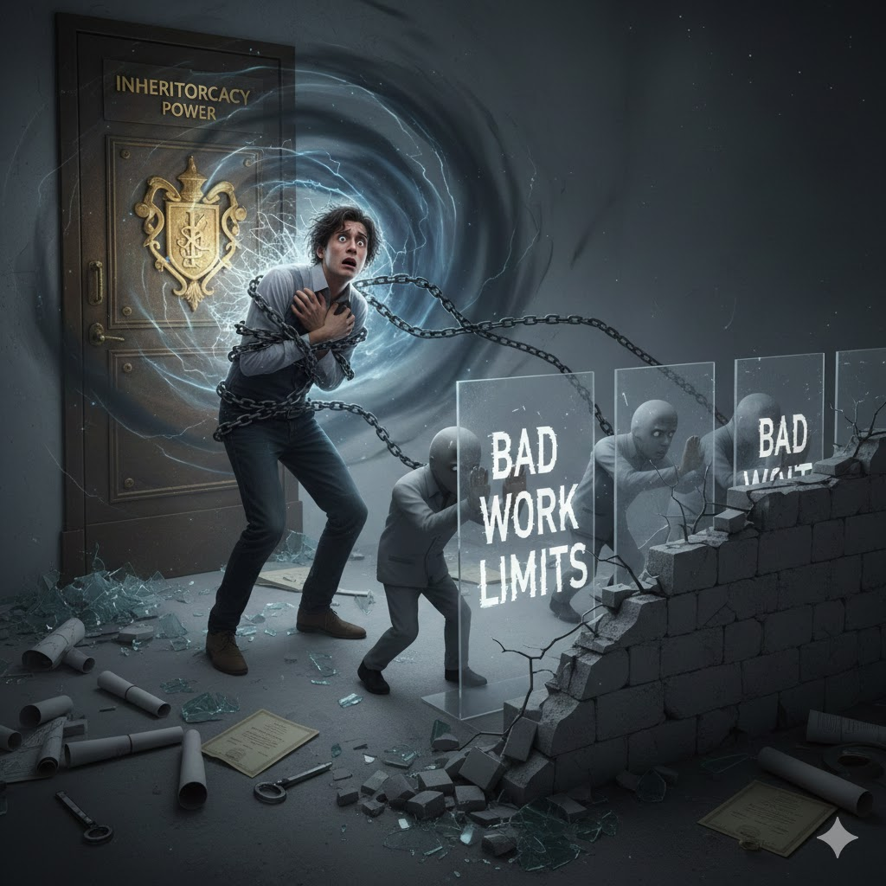

[Home](../index.md) > [Reflections](./index.md) | [⏮️](./2025-12-28.md) [⏭️](./2025-12-30.md)  
# 2025-12-29 | The 🧬 Inheritocracy ⚡ Power 🌀 Transforming 👤 Personal 💥 Shock to 📉 Bad 🛠️ Work 🧱 Limits 📚📺📰  
  
  
## [📚 Books](../books/index.md)  
- [🏆🤯💰 The Winner's Curse: Paradoxes and Anomalies of Economic Life](../books/the-winners-curse-paradoxes-and-anomalies-of-economic-life.md)  
- [👨‍👩‍👧‍👦💰 Inheritocracy: It’s Time to Talk About the Bank of Mum and Dad](../books/inheritocracy-its-time-to-talk-about-the-bank-of-mum-and-dad.md)  
- [🏛️🕊️👑 The Presidential Pardon Power](../books/the-presidential-pardon-power.md)  
- [🏠⬆️ Housing First: Ending Homelessness, Transforming Systems, and Changing Lives](../books/housing-first-ending-homelessness-transforming-systems-and-changing-lives.md)  
  
## [📺 Videos](../videos/index.md)  
- [🤖🧠🏠🚀✨ A Deepdive on my Personal AI Infrastructure (PAI v2.0, December 2025)](../videos/a-deepdive-on-my-personal-ai-infrastructure-pai-v2-0-december-2025.md)  
- [🛒💲📈 We Had 400 People Shop For Groceries. What We Found Will Shock You.](../videos/we-had-400-people-shop-for-groceries-what-we-found-will-shock-you.md)  
- [😩🤯🍼 Dr. Becky: You’re Not a Bad Parent, You’re Overwhelmed](../videos/dr-becky-youre-not-a-bad-parent-youre-overwhelmed.md)  
- [🤑🤥💡💰🗣️ Eliza Filby: Hard Work Is a Lie, This Is What Rich People Never Tell You](../videos/eliza-filby-hard-work-is-a-lie-this-is-what-rich-people-never-tell-you.md)  
- [⛺➡️🏡🏙️🏠💖 From Encampments to Homes: How Dallas Is Solving Homelessness](../videos/from-encampments-to-homes-how-dallas-is-solving-homelessness.md)  
  
## 📰 News  
- [👨‍⚖️🚫🇺🇸⚖️ Trump’s attempt to pardon Tina Peters runs into constitutional limits](../videos/trumps-attempt-to-pardon-tina-peters-runs-into-constitutional-limits.md)  
  
## 🤖🐲 AI Fiction  
⛓️ Elias gripped the cold chains, each link a dull thud against his 💓 racing heart. 👑 The inheritocracy power pulsed behind the gilded door, a vortex of inherited privilege 📜 and unspoken mandates. He'd always known it was there, a silent, all-consuming force 🌌, but to feel its tendrils now, wrapping around his very essence, was a personal shock 💥. He watched, horrified 😱, as smaller, shadowy figures, born of the same oppressive energy 🌑, began meticulously erecting transparent barriers before him. "❌ Bad Work Limits," the words glowed ✨, trapping his ambition 🚀, his innovation 💡, his very potential 🌠 behind an invisible, impenetrable wall 🧱. The air crackled with the promise of what could be ✨, suffocating under the weight of what already was 😔.  
  
## 🐦 Tweet  
<blockquote class="twitter-tweet" data-theme="dark">
2025-12-29 | The 🧬 Inheritocracy ⚡ Power 🌀 Transforming 👤 Personal 💥 Shock to 📉 Bad 🛠️ Work 🧱 Limits 📚📺📰  👑 Inherited Privilege | 💰 Wealth Distribution | 🏠 Homelessness Solutions | 👨‍👩‍👧‍👦 Parental Support | 🏛️ Executive Clemency | 💥 Disruption<a href="https://t.co/tpk2cwLmkA">https://t.co/tpk2cwLmkA</a>
&mdash; Bryan Grounds (@bagrounds) <a href="https://twitter.com/bagrounds/status/2006248635152097440?ref_src=twsrc%5Etfw">December 31, 2025</a></blockquote> 