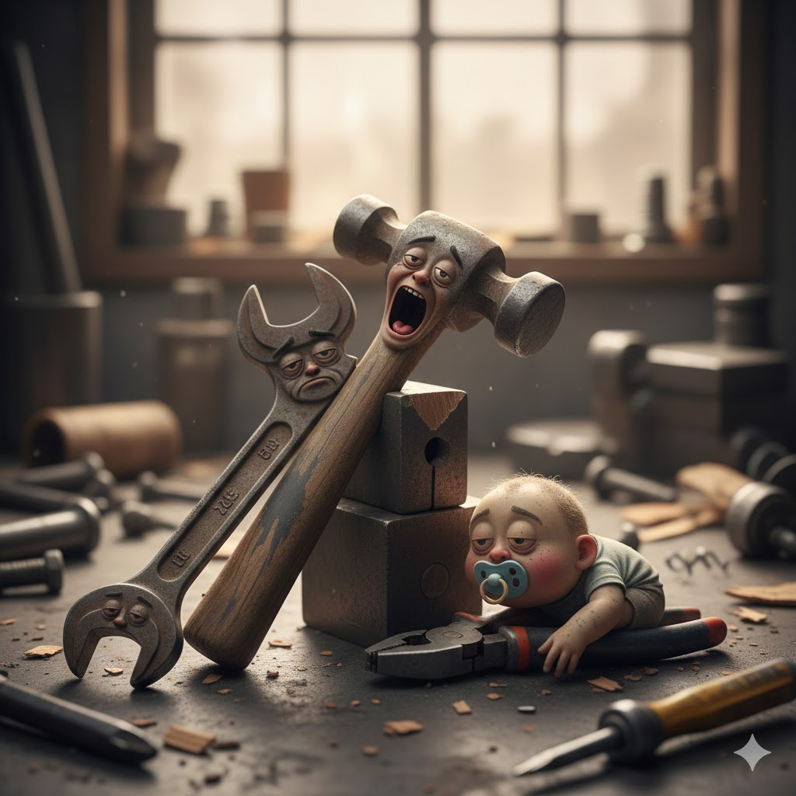

[Home](../index.md) > [Reflections](./index.md) | [⏮️](./2025-12-31.md) [⏭️](./2026-01-02.md)  
# 2026-01-01 | 🥱 Tired 🍼 Immature 🛠️ Tools 📺📚  
  
  
## [📺 Videos](../videos/index.md)  
- [🔋⚡😴🌞 How to never be tired again](../videos/how-to-never-be-tired-again.md)  
  
## [📚 Books](../books/index.md)  
- ⏯️ Continuing [🧑‍🧒💔🩹 Adult Children of Emotionally Immature Parents: How to Heal from Distant, Rejecting, or Self-Involved Parents](../books/adult-children-of-emotionally-immature-parents-how-to-heal-from-distant-rejecting-or-self-involved-parents.md)  
- [❤️‍🩹👶🚫🌱 Recovering from Emotionally Immature Parents: Practical Tools to Establish Boundaries & Reclaim Your Emotional Autonomy](../books/recovering-from-emotionally-immature-parents-practical-tools-to-establish-boundaries-reclaim-your-emotional-autonomy.md)  
  
## 🤖🐲 AI Fiction  
🛠️ In the chaotic workshop, amidst the usual clutter of 🪵 sawdust and 🔩 forgotten screws, lived a peculiar set of 🧰 tools. 🔨 There was Hammer, 😫 perpetually exasperated, his face a caricature of an 😱 open-mouthed scream, always on the verge of 🥱 collapsing from sheer fatigue. 🔧 Leaning against him, the Wrench, 😔 forever burdened with a droopy, melancholic expression, seemed to carry the 🏋️ weight of all the world's unfinished projects. 👶 And then there was Baby Pliers, a chubby, 🍼 pacifier-clutching infant, sprawling across the 🪵 workbench, creating more 🌪️ mess than order. 🎶 Their existence was a symphony of 💨 sighs, 😣 groans, and the occasional 😢 whimper, a testament to the fact that even in the 🌍 world of tools, some days were just 🧱 harder than others.  
  
## 🐦 Tweet  
<blockquote class="twitter-tweet" data-theme="dark">
2026-01-01 | 🥱 Tired 🍼 Immature 🛠️ Tools 📺📚  🔋⚡😴🌞 Energy &amp; Fatigue Relief | ❤️‍🩹👶🚫🌱 Emotional Autonomy | 🤖🐲 AI Fiction | 🪵⚙️🛠️ Workshop Chaos | 🔨😫 Hammer&#39;s Exhaustion | 🔧😔 Wrench&#39;s Melancholy | 🍼👶 Baby Pliers &amp; Mess<a href="https://t.co/2nTj30FSlP">https://t.co/2nTj30FSlP</a>
&mdash; Bryan Grounds (@bagrounds) <a href="https://twitter.com/bagrounds/status/2007526896180027719?ref_src=twsrc%5Etfw">January 3, 2026</a></blockquote> 