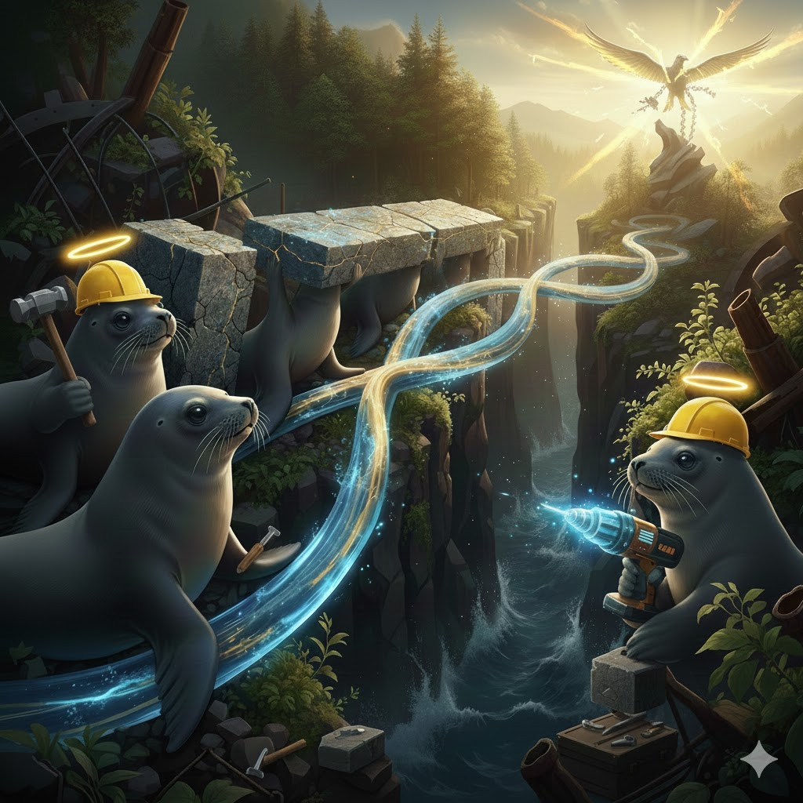

[Home](../index.md) > [Reflections](./index.md) | [⏮️](./2026-01-01.md) [⏭️](./2026-01-03.md)  
# 2026-01-02 | 😇 Good 🦭 Seals 🛠️ Build 🏗️ Resilient 🗽 Freedom 📺📚  
  
  
## [📺 Videos](../videos/index.md)  
- [🪖💪💯 Jocko Willink «GOOD» (Official)](../videos/jocko-willink-good-official.md)  
- [💪🧠🔒5️⃣ How To Build Unbreakable Discipline (5 Steps)](../videos/how-to-build-unbreakable-discipline-5-steps.md)  
- [💪🧠⚔️🤝 How to Become Resilient, Forge Your Identity & Lead Others | Jocko Willink](../videos/how-to-become-resilient-forge-your-identity-lead-others-jocko-willink.md)  
  
## [📚 Books](../books/index.md)  
- [🫡👑🏆 Extreme Ownership: How U.S. Navy SEALs Lead and Win](../books/extreme-ownership-how-us-navy-seals-lead-and-win.md)  
- [🌟🔓 Development as Freedom](../books/development-as-freedom.md)  
  
## 🤖🐲 AI Fiction  
🌊 In the deep chasm of the Great Divide, where the 🌀 currents of life churned relentlessly, lived the 🦭 Good Seals. Clad in 👷 yellow hard hats and 😇 gleaming halos, they were more than creatures of the sea; they were 🏗️ architects of hope. With 🔨 hammers clanging and ⚙️ drills humming, they meticulously crafted a 🌉 bridge of 💡 light and 🪨 stone. Each 🧱 block represented a challenge overcome, each ✨ shimmering arc a testament to their unwavering spirit. Their 🎯 goal was singular: to 🔗 connect the fragmented shores, ensuring that the 🛡️ fragile sprout of 🌱 Freedom, nestled on the distant cliff, would forever 🌸 bloom, resilient against any ⛈️ storm.