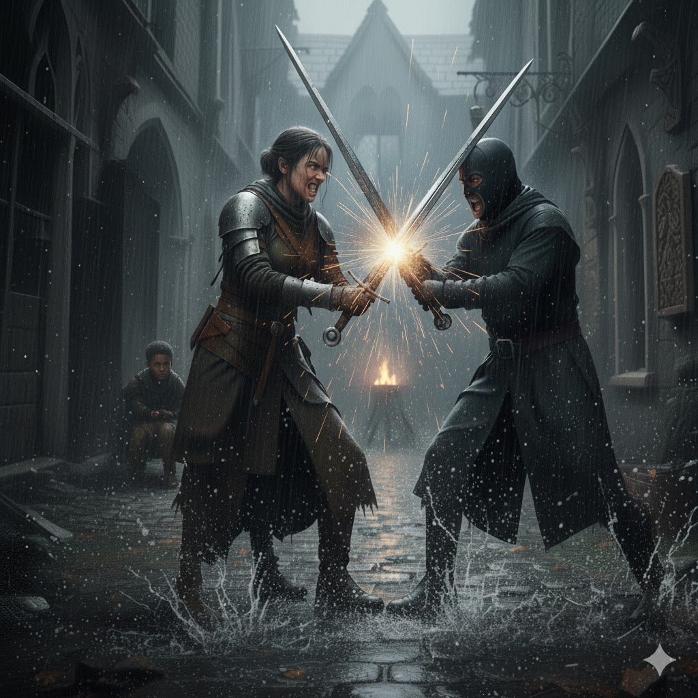

[Home](../index.md) > [Reflections](./index.md) | [⏮️](./2026-01-06.md) [⏭️](./2026-01-08.md)  
# 2026-01-07 | 🇺🇸 Collateral 🪦 Damage 📺📰📚  
  
  
## [📺 Videos](../videos/index.md)  
- [💡🔄🤖 Build a Prompt Learning Loop - SallyAnn DeLucia & Fuad Ali, Arize](../videos/build-a-prompt-learning-loop-sallyann-delucia-fuad-ali-arize.md)  
- [🏃🤸🧠🏋️‍♂️ Run, Jump, Learn! How Exercise can Transform our Schools: John J. Ratey, MD at TEDxManhattanBeach](../videos/run-jump-learn-how-exercise-can-transform-our-schools-john-j-ratey-md-at-tedxmanhattanbeach.md)  
- [🤯🔋🚫💪 Emily Nagoski and Amelia Nagoski: The cure for burnout (hint: it isn't self-care) | TED](../videos/emily-nagoski-and-amelia-nagoski-the-cure-for-burnout-hint-it-isnt-self-care-ted.md)  
- [💡🔬🌱 Mindvalley Book of the Week: Anne-Laure Le Cunff's Tiny Experiments](../videos/mindvalley-book-of-the-week-anne-laure-le-cunffs-tiny-experiments.md)  
  
## 📰 News  
- [🥼💉❓🇺🇸 What the overhaul of U.S. vaccine guidance means for public health](../videos/what-the-overhaul-of-u-s-vaccine-guidance-means-for-public-health.md)  
- [🚨🚔💥⚰️🇺🇸 Gov. Walz holds briefing after ICE agent shoots and kills woman in Minneapolis](../videos/watch-live-gov-walz-holds-briefing-after-ice-agent-shoots-and-kills-woman-in-minneapolis.md)  
  
## [📚 Books](../books/index.md)  
- [💉👶⚖️ Vaccines and Your Child: Separating Fact from Fiction](../books/vaccines-and-your-child-separating-fact-from-fiction.md)  
- [🧪🎯🦋 Tiny Experiments: How to Live Freely in a Goal-Obsessed World](../books/tiny-experiments-how-to-live-freely-in-a-goal-obsessed-world.md)  
- [⚡🧠🏃 Spark: The Revolutionary New Science of Exercise and the Brain](../books/spark-the-revolutionary-new-science-of-exercise-and-the-brain.md)  
- ⏯️ Continuing [😈🔥👹 The Devils](../books/the-devils.md)  
  
## 🤖🐲 AI Fiction  
🏙️ The alley was a narrow throat of 🏚️ rot and shadows. 🛡️ Elara stood her ground, her 💓 heart drumming a frantic, ugly rhythm against her ribs.  
  
👦 Behind her, the boy huddled in the 🌑 dark - a scrap of human grit in the ⚙️ state’s gears. The 🕴️ agents moved in with the bored grace of 🔪 butchers. One drew a long, 🗡️ grey blade, the steel whispering as it cleared the scabbard. He swung in a casual arc, aiming for the boy’s neck.  
  
🤺 Elara moved. Her ⚔️ sword met his with a jarring, bone-deep 💥 **clang**.  
  
🦷 The vibration rattled her teeth, but she 🧱 didn't give an inch. She leaned into the bind, shoved the man’s weight back, and found the 🔓 opening. She saw the 👁️ fear flicker in his stone-flat eyes. She had him. One 🕒 quick turn of the wrist and she’d be clear, the boy safe, the day won. She felt a ⚡ jolt of heat in her marrow - a wild, soaring 🏆 triumph.  
  
❄️ Then the cold 🗡️ bit through her back.  
  
🗡️ It wasn't a roar or a flash; just a foot of sharp, indifferent steel 🩸 punching through her ribs from behind. A 👤 second agent had stepped in, silent as a 🌑 shadow.  
  
🛐 Elara’s knees hit the 🤮 filth. The 🌀 world tilted, her victory turning to a sudden, 🧊 biting ice. She watched the 👢 boy’s boots vanish into the gloom - a frantic, fading beat of 🏃 footsteps.  
  
🏠 *I should've stayed home,* she 💭 thought, her 🌫️ vision narrowing to a grey pinprick. Her 👨‍👩‍👧‍👦 children’s faces flickered in the dark, and a sudden, 💔 bitter pang twisted what was left of her heart.  
  
## 🐦 Tweet  
<blockquote class="twitter-tweet" data-theme="dark">
2026-01-07 | 🇺🇸 Collateral 🪦 Damage 📺📰📚  💡🔄🤖 Prompt Engineering | 🏃🤸🧠🏋️‍♂️ Exercise and Learning | 🤯🔋🚫💪 Burnout &amp; Self-Care Alternatives | 💉🥼🇺🇸 Vaccine Guidance | 🚨🚔💥 Law Enforcement Incident | 🧪🎯🦋 Goal-Obsessed | 👨‍👩‍👧‍👦💔 Family Sacrifice<a href="https://t.co/Vhi1IhW2En">https://t.co/Vhi1IhW2En</a>
&mdash; Bryan Grounds (@bagrounds) <a href="https://twitter.com/bagrounds/status/2009163345572614587?ref_src=twsrc%5Etfw">January 8, 2026</a></blockquote> 