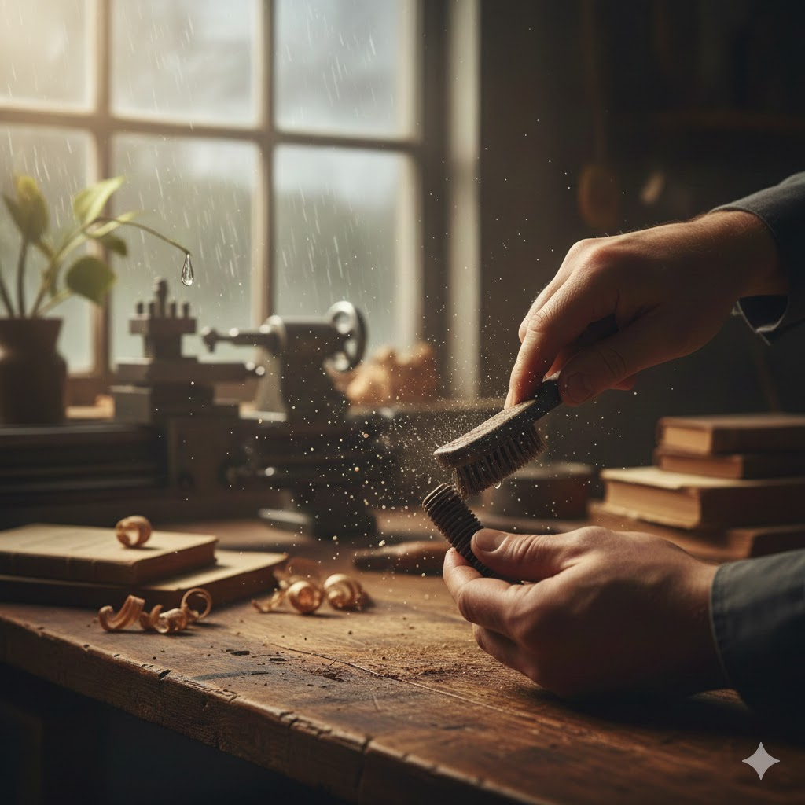

[Home](../index.md) > [Reflections](./index.md) | [⏮️](./2026-01-08.md)  
# 2026-01-09 | 🤔 How Does 💧 Water 🔨 Work? 📚📺  
  
  
## [📚 Books](../books/index.md)  
- [🌊🥋 Be Water, My Friend: The Teachings of Bruce Lee](../books/be-water-my-friend-the-teachings-of-bruce-lee.md)  
- ▶️ Starting [⚡🧠🏃 Spark: The Revolutionary New Science of Exercise and the Brain](../books/spark-the-revolutionary-new-science-of-exercise-and-the-brain.md)  
- [🛠️💖 Shop Class as Soulcraft: An Inquiry Into the Value of Work](../books/shop-class-as-soulcraft-an-inquiry-into-the-value-of-work.md)  
  
## [📺 Videos](../videos/index.md)  
- [🏃🤸💃📚 The Kinesthetic Classroom: Teaching and Learning through Movement | Michael Kuczala | TEDxAshburn](../videos/the-kinesthetic-classroom-teaching-and-learning-through-movement-michael-kuczala-tedxashburn.md)  
  
## 💧 What does Water do When Tired?  
- ⭕ **Pool: Accumulate** Stop. Stay still. Gather resources until they overflow.  
- 📉 **Path: Glide** Yield. Drop resistance. Follow the easiest downward slope.  
- 🧊 **Ice: Crystallize** Freeze. Rely on rigid habits when you lack flow.  
- 🌊 **Current: Merge** Attach. Join a moving system. Let the momentum carry you.  
- 🌫️ **Mist: Evaporate** Dissolve. Lighten your presence. Drift until you are ready to condense.  
- ⏳ **Drip: Persist** Pulse. Abandon force for rhythm. Small strikes carve stone.  
- 🌿 **Dew: Settle** Rest. Stop traveling. Simply exist where you are.  
  
## 🤖🐲 AI Fiction  
👨‍🎨 The craftsman sat among the 🌫️ dust of half-finished things. His mind was a 🪨 heavy stone. He had tried to 😤 push, to force the work, but his 🌬️ spirit was thin.  
  
🌧️ He looked at the rain outside. It did not struggle. When the ground was 🧱 hard, it 💧 pooled. When the path 🛣️ opened, it 🌊 ran.  
  
🤫 He stopped fighting the silence. He picked up a 🛠️ single tool and began a ⏳ slow, rhythmic motion—not to finish, but to move. He stopped being the 👑 master and became the 🔄 process.  
  
📉 The heavy stone in his mind began to wear away. Not by a 💥 great blow, but by the 🤲 steady pulse of his hands. He found that when you stop trying to be the 🌊 ocean, you finally find the strength of the 💧 drop.  
  
🌆 By evening, the work was done. He did not feel like a 🏆 conqueror. He felt like the 🌍 earth after a ⛈️ storm: 🤫 quiet, 💦 damp, and ready to 🌱 grow.