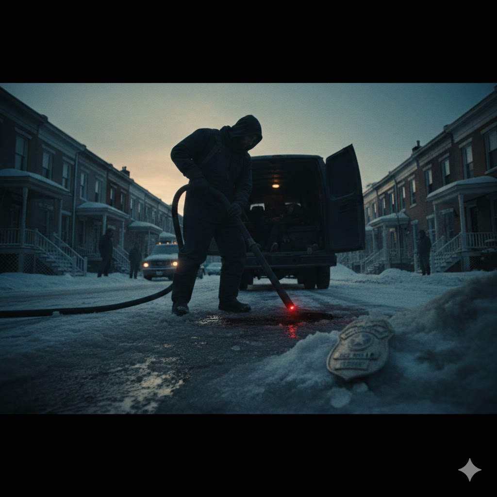

[Home](../index.md) > [Reflections](./index.md) | [⏮️](./2026-01-09.md) [⏭️](./2026-01-11.md)  
# 2026-01-10 | 🧼📰 Public Record 📚🪞🌌📺📰  
  
  
## [📚 Books](../books/index.md)  
- ⏯️ Continuing [⚡🧠🏃 Spark: The Revolutionary New Science of Exercise and the Brain](../books/spark-the-revolutionary-new-science-of-exercise-and-the-brain.md)  
- [🧊💰⛵🏛️ So You Want to Own Greenland?: Lessons from the Vikings to Trump](../books/so-you-want-to-own-greenland-lessons-from-the-vikings-to-trump.md)  
  
## ☕🥦🥩🍚🍔🍦 When should I eat what?  
- ⚡ For abundant energy  
    - ⏳ Intermittent fasting  
        - 🍱 In order to keep my eating window small, I've been delaying my first meal until noon for months.  
        - 🥗 But eating triggers cortisol, which we want plenty of in the morning.  
        - 🤔 So should I eat first thing, in order to boost my morning cortisol or wait until noon to give my organs a break?  
        - 💡 Maybe I should eat first thing in the morning and stop eating earlier in the evening.  
  
## [🌌 Topics](../topics/index.md)  
- [🇺🇸🗣️💡🗓️ A Presidential Platform for Americans 2028](../topics/a-presidential-platform-for-americans-2028.md)  
  
## [📺 Videos](../videos/index.md)  
- [😠🗣️🚫🤬 Republican Thom Tillis' SCATHING message to Stephen Miller](../videos/im-sick-of-stupid-republican-thom-tillis-scathing-message-to-stephen-miller.md)  
- [😠✊🇩🇪🇮🇹🇷🇺🇺🇸 It’s Time to Talk About Fascism | Explainer](../videos/its-time-to-talk-about-fascism-explainer.md)  
- [✨😮🗣️ Something Interesting Happened Today | Explainer](../videos/something-interesting-happened-today-explainer.md)  
  
## 📰 News  
- [🚨🔫🪦 Brooks and Capehart on the response to the Minnesota ICE shooting](../videos/brooks-and-capehart-on-the-response-to-the-minnesota-ice-shooting.md)  
  
## 🤖🐲 AI Fiction  
  
🔊 The vacuum hummed, rattling Caleb’s teeth. 🚿 He watched the nozzle as crimson slush vanished.  
  
⏱️ "Six minutes until the salt trucks," a voice crackled. 🧼 "You know the drill. Spotless by sunrise."  
  
🧊 Caleb didn't look up. 🚐 He dragged a blue parka toward the unmarked van and heaved the body over the floorboards.  
  
🛰️ "Drone footage is looped," the voice said. 🔫 "Get the bodies inside and clear the brass."  
  
🧤 Caleb knelt, plucking casings from the ice with practiced efficiency.  
  
🛑 The last body lay near the hydrant. 👮🏽‍♂️ Caleb paused, his fingers brushing a badge pinned to navy wool: Jace Miller. 🏘️ He glanced at the quiet porches, then back at the name.  
  
☀️ "Caleb. Move it. The sun’s coming up."  
  
🕳️ Caleb unclipped the badge and shoved it into the gutter. 🌊 He turned the high-pressure hose on the remaining stains, watching the red melt into the sewer until the concrete was bone-white.  
  
## 🐦 Tweet  
<blockquote class="twitter-tweet" data-theme="dark">
2026-01-10 | 🧼📰 Public Record 📚🪞🌌📺📰  🏃‍♀️ Exercise Science | 🧊 Greenland&#39;s Future | 🗓️ Political Platforms | 😠 Political Commentary | ✊ Fascism Analysis | 📰 Current Events | 🤖 AI Narratives<a href="https://t.co/9unruGuieM">https://t.co/9unruGuieM</a>
&mdash; Bryan Grounds (@bagrounds) <a href="https://twitter.com/bagrounds/status/2011671099915039196?ref_src=twsrc%5Etfw">January 15, 2026</a></blockquote> 