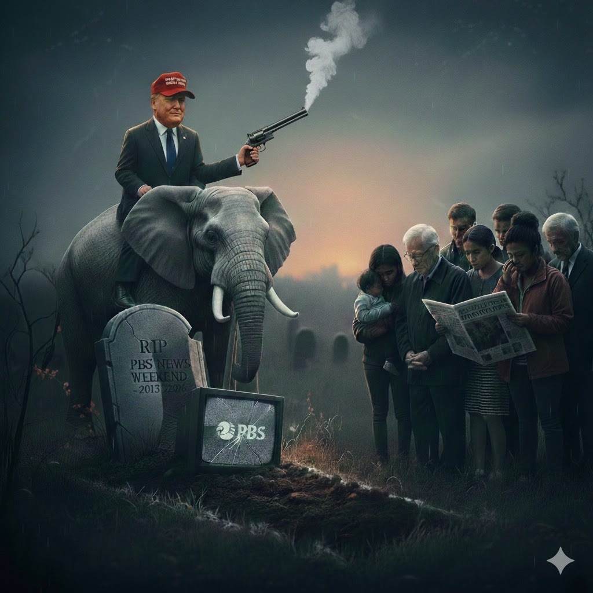

[Home](../index.md) > [Reflections](./index.md) | [⏮️](./2026-01-10.md) [⏭️](./2026-01-12.md)  
# 2026-01-11 | 🪦 RIP 📺 PBS 📰 News 🗓️ Weekend 📺📚📰  
  
  
> 📺 Today, we bid a fond and solemn farewell to **PBS News Weekend**, a broadcast that has served as a steady beacon of clarity for over a decade. 🕰️ For thirteen years, this "small but mighty" team committed themselves to the quiet dignity of the facts, proving that even in the rush of the weekend, there was always space for deep reflection and human connection.  
>  
> 📜 Since its inception in 2013, the program has been more than just a summary of the day’s events. 🌍 It traveled from the bustling streets of New York to the heart of the nation’s capital, and from the edges of the Scottish coast to the vast plains of the American West. 🔬 It was a show that found the extraordinary in the overlooked - whether it was the history of the U.S. Mint, the innovation of a 14-year-old scientist, or the survival of rural ranchers.  
>  
> ❤️ We remember PBS News Weekend not just for its headlines, but for its heart. 📢 It gave voice to the vulnerable through its "Saving Species" and "Unequal Treatment" series, and it celebrated the curious, the quirky, and the profound.  
>  
> 🕯️ Though the show now goes off the air due to a lack of federal funding, its legacy remains in the stories it told and the standard of excellence it upheld. 🤝 To the dedicated producers, the technical wizards, and to John Yang - thank you for the privilege of your company.  
>  
> 🌅 The news continues, but the weekend will feel a little quieter without you.  
>  
> 🌙 **Good night, and thank you.**  
  
## [📺 Videos](../videos/index.md)  
- [🚨🛡️ICE and the National Guard Are Acting with Impunity](../videos/ice-and-the-national-guard-are-acting-with-impunity.md)  
- [🕵️‍♂️🤫🚫🗣️🥷 How Governments Spy On Protestors - And How To Avoid It | Incognito Mode | WIRED](../videos/how-governments-spy-on-protestors-and-how-to-avoid-it-incognito-mode-wired.md)  
- [🧠➡️🤖⚡️ Your Brain Doesn't Command Your Body. It Predicts It. | Max Bennett](../videos/your-brain-doesnt-command-your-body-it-predicts-it-max-bennett.md)  
  
## [📚 Books](../books/index.md)  
- ⏯️ Continuing [⚡🧠🏃 Spark: The Revolutionary New Science of Exercise and the Brain](../books/spark-the-revolutionary-new-science-of-exercise-and-the-brain.md)  
- [📢💡 Public Broadcasting and the Public Interest](../books/public-broadcasting-and-the-public-interest.md)  
  
## 📰 News  
- [📺📰👋🔚😢😠 Highlights from PBS News Weekend as show goes off the air](../videos/highlights-from-pbs-news-weekend-as-show-goes-off-the-air.md)