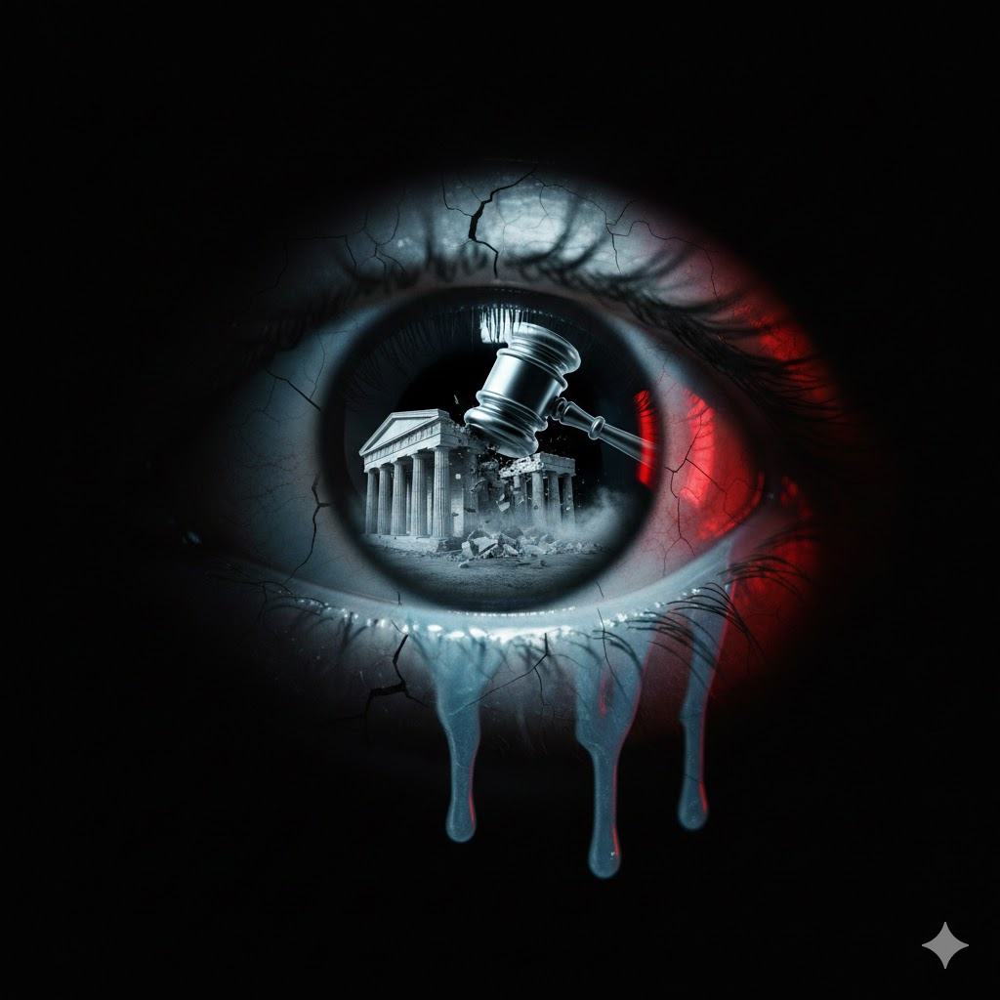

[Home](../index.md) > [Reflections](./index.md) | [⏮️](./2026-01-11.md) [⏭️](./2026-01-13.md)  
# 2026-01-12 | ▶️ Initially 🕵️‍♀️ Secret ⚖️ Impeachment 👨‍⚖️ Sues 🏛️ Democracy ⌛ After 💔 Breaking 🧠 Brain 🔋 Burnout 👮‍♀️ Policing ⚠️ Threats 📚📺📰  
  
  
## [📚 Books](../books/index.md)  
- ⏯️ Continuing [⚡🧠🏃 Spark: The Revolutionary New Science of Exercise and the Brain](../books/spark-the-revolutionary-new-science-of-exercise-and-the-brain.md)  
- [👮‍♀️🪢 Tangled Up in Blue: Policing the American City](../books/tangled-up-in-blue-policing-the-american-city.md)  
  
## [📺 Videos](../videos/index.md)  
- [🏛️🇺🇸⚖️🗣️👮‍♀️💔 Illinois Gov. JB Pritzker Calls For DHS Sec. Kristi Noem's Impeachment After ICE Agent Kills Woman](../videos/illinois-gov-jb-pritzker-calls-for-dhs-sec-kristi-noems-impeachment-after-ice-agent-kills-woman.md)  
- [👨‍⚖️🇺🇸⚖️ Sen. Kelly Sues Secretary Hegseth](../videos/sen-kelly-sues-secretary-hegseth.md)  
- [🏛️📰🗣️🇺🇸 Jelani Cobb talks democracy, Trumpism, and the future of journalism | Code Switch](../videos/jelani-cobb-talks-democracy-trumpism-and-the-future-of-journalism-code-switch.md)  
- [🤥🗣️📰 Why did we stop caring about disinformation? | Skylar Hughes | TEDxDuke](../videos/why-did-we-stop-caring-about-disinformation-skylar-hughes-tedxduke.md)  
- [📈🔋🧘‍♀️ The 1% Health Rule: What People Who Never Burn Out Do Differently](../videos/the-1-percent-health-rule-what-people-who-never-burn-out-do-differently.md)  
- [🕵️‍♀️🚫🚗💥🔫 Initially-Secret Report: Customs&Border Patrol Agents Got in Way of Vehicles, Then Used Deadly Force](../videos/initially-secret-report-customs-border-patrol-agents-got-in-way-of-vehicles-then-used-deadly-force.md)  
- [🚨🗣️🏛️💔 A Breaking Point: The Minneapolis Police Chief on ICE](../videos/a-breaking-point-the-minneapolis-police-chief-on-ice.md)  
  
## 📰 News  
- [🏦 🇺🇸 📉 🗣️ Tamara Keith and Amy Walter on pushback to Trump's threats to Federal Reserve](../videos/tamara-keith-and-amy-walter-on-pushback-to-trumps-threats-to-federal-reserve.md)  
  
## 🤖🐲 AI Fiction  
📂 The archive’s seal was initially cracked by a secret leak. 🏛️ By morning, democracy found itself in an unprecedented cage: it sues the very citizens it once served. 💔 After breaking the news, the city’s collective brain simply stalled. 🔋 A total burnout of the civic soul followed. 👮‍♀️ Policing the fallout became a phantom task as the legal impeachment of the public mind took hold. ⚠️ We were no longer voters; we were threats to our own stability, processed by a machine that had finally learned to fear its own shadow.  
  
## 🐦 Tweet  
<blockquote class="twitter-tweet" data-theme="dark">
2026-01-12 | ▶️ Initially 🕵️‍♀️ Secret ⚖️ Impeachment 👨‍⚖️ Sues 🏛️ Democracy ⌛ After 💔 Breaking 🧠 Brain 🔋 Burnout 👮‍♀️ Policing ⚠️ Threats 📚📺📰  ⚡🧠🏃 Exercise Science | 👮‍♀️🪢 Policing | 🏛️ Democracy | 🤥 Disinformation | 🕵️‍♀️ Misconduct | 🏦 Federal Reserve<a href="https://t.co/rHFfx3KvH9">https://t.co/rHFfx3KvH9</a>
&mdash; Bryan Grounds (@bagrounds) <a href="https://twitter.com/bagrounds/status/2011672066123317759?ref_src=twsrc%5Etfw">January 15, 2026</a></blockquote> 