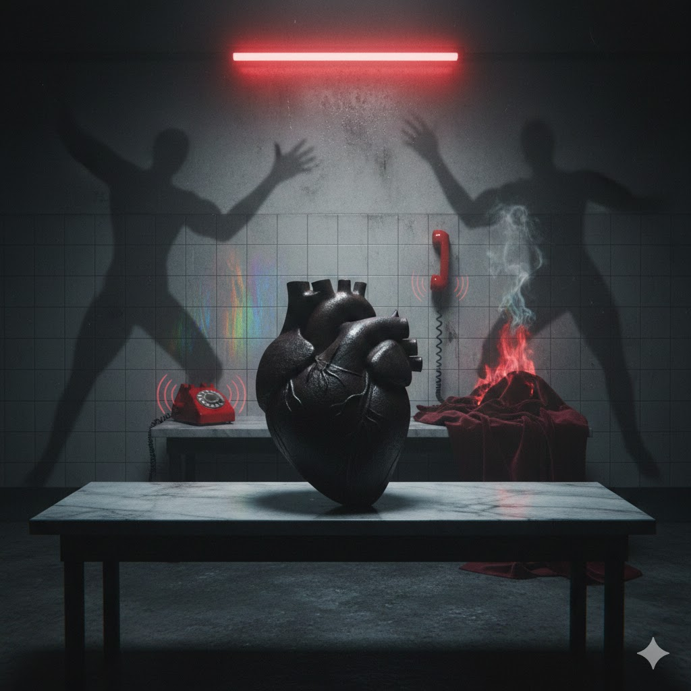

[Home](../index.md) > [Reflections](./index.md) | [⏮️](./2026-01-12.md) [⏭️](./2026-01-14.md)  
# 2026-01-13 | 🔥 Devils ⚡ Spark ❤️ Heart 📚📺  
  
  
## [📚 Books](../books/index.md)  
- 🏁 Finished [⚡🧠🏃 Spark: The Revolutionary New Science of Exercise and the Brain](../books/spark-the-revolutionary-new-science-of-exercise-and-the-brain.md)  
- ⏯️ Continuing [😈🔥👹 The Devils](../books/the-devils.md)  
  
## [📺 Videos](../videos/index.md)  
- [❤️⬇️🔬 Lower Your Resting Heart Rate (The Simple Science Most People Miss) | Dr. Andy Galpin 5 Minute Phys](../videos/lower-your-resting-heart-rate-the-simple-science-most-people-miss-dr-andy-galpin-5-minute-phys.md)  
  
## 🤖🐲 AI Fiction  
👹 Devils whispered that the rhythm was far too slow for salvation. ⚡ Sparking synapses fired like distant lightning across the darkened gymnasium of the mind. ❤️ Heart beats thudded against the ribs of a ghost seeking a lower, quieter frequency of existence. 🔬 Science could not explain why the shadow began to run toward the light.  
  
## 🐦 Tweet  
<blockquote class="twitter-tweet" data-theme="dark">
2026-01-13 | 🔥 Devils ⚡ Spark ❤️ Heart 📚📺  📚 Book Recommendations | ⚡ Brain Science | 🏃 Exercise Benefits | ❤️ Heart Health | 😈 Demonic Narratives | 🤖 AI Storytelling<a href="https://t.co/G9HxPqNday">https://t.co/G9HxPqNday</a>
&mdash; Bryan Grounds (@bagrounds) <a href="https://twitter.com/bagrounds/status/2011672329290502498?ref_src=twsrc%5Etfw">January 15, 2026</a></blockquote> 